# Browse Lifetime & GST Exemption Limit

## Overview

This pages shows the remaining Lifetime & GST exemption limit for any particular Individual. Using this page Clarius team can know how much Lifetime & GST limit is available for any Individual

#### What is Lifetime Exemption

Starting in 2020, the lifetime gift tax exemption is $11.58 million. This means that Individual can give up to $11.58 million in gifts over the course of your lifetime without ever having to pay gift tax on it. Government can increase this amount in upcoming years. So this figure can be increased over time.

For Joints, both Individual get the $11.58 million exemption. It means that both Individual can give away a total of $23.16 million before paying the gift tax.

For example, if Individual gifted someone $20,000, He has to file a gift tax return for $5,000, the amount over the annual exclusion, but that $5,000 will be deducted from lifetime exclusion amount.  So if he has not used that limit yet, he may not have to pay taxes on that money yet.

See below table for Master ledger of Lifetime exemption 

| Year | Annual Increase | Statutory Lifetime Gift Tax Exemption |
| ---- | --------------- | ------------------------------------- |
| 1980 | -               | 161,000                               |
| 1981 | 14,000          | 175,000                               |
| 1982 | 50,000          | 225,000                               |
| 1983 | 50,000          | 275,000                               |
| 1984 | 50,000          | 325,000                               |
| 1985 | 75,000          | 400,000                               |
| 1986 | 100,000         | 500,000                               |
| 1987 | 100,000         | 600,000                               |
| 1988 | -               | 600,000                               |
| 1989 | -               | 600,000                               |
| 1990 | -               | 600,000                               |
| 1991 | -               | 600,000                               |
| 1992 | -               | 600,000                               |
| 1993 | -               | 600,000                               |
| 1994 | -               | 600,000                               |
| 1995 | -               | 600,000                               |
| 1996 | -               | 600,000                               |
| 1997 | -               | 600,000                               |
| 1998 | 25,000          | 625,000                               |
| 1999 | 25,000          | 650,000                               |
| 2000 | 25,000          | 675,000                               |
| 2001 | -               | 675,000                               |
| 2002 | 325,000         | 1,000,000                             |
| 2003 | -               | 1,000,000                             |
| 2004 | -               | 1,000,000                             |
| 2005 | -               | 1,000,000                             |
| 2006 | -               | 1,000,000                             |
| 2007 | -               | 1,000,000                             |
| 2008 | -               | 1,000,000                             |
| 2009 | -               | 1,000,000                             |
| 2010 | -               | 1,000,000                             |
| 2011 | 4,000,000       | 5,000,000                             |
| 2012 | 120,000         | 5,120,000                             |
| 2013 | 130,000         | 5,250,000                             |
| 2014 | 90,000          | 5,340,000                             |
| 2015 | 90,000          | 5,430,000                             |
| 2016 | 20,000          | 5,450,000                             |
| 2017 | 40,000          | 5,490,000                             |
| 2018 | 5,690,000       | 11,180,000                            |
| 2019 | 220,000         | 11,400,000                            |
| 2020 | 180,000         | 11,580,000                            |
| 2021 | -               | 11,580,000                            |

#### What is GST Exemption

In addition to Lifetime Exemption, Individual can also have GST tax exemption. GST stands for Generation Skipping Transfer tax. Each individual has a certain amount of "GST" gifts they can make during their life, or at death. It is a second table similar to Lifetime exemption but it has different limits.

Here, The child's generation is skipped to avoid an inheritance being subject to estate taxes twice—once when it moves from the grandparents to their children, and then from those children to their children. 

All Gifts reduce the "Lifetime exemption", only gifts marked as "GST" will be allocated against the balance of this GST Exemption.

See below table for Master ledger of GST exemption

| Year | Annual increase | Statutory GST Exemption |
| ---- | --------------- | ----------------------- |
| 1985 | -               | 1,000,000               |
| 1986 | -               | 1,000,000               |
| 1987 | -               | 1,000,000               |
| 1988 | -               | 1,000,000               |
| 1989 | -               | 1,000,000               |
| 1990 | -               | 1,000,000               |
| 1991 | -               | 1,000,000               |
| 1992 | -               | 1,000,000               |
| 1993 | -               | 1,000,000               |
| 1994 | -               | 1,000,000               |
| 1995 | -               | 1,000,000               |
| 1995 | -               | 1,000,000               |
| 1997 | -               | 1,000,000               |
| 1998 | -               | 1,000,000               |
| 1999 | 10,000          | 1,010,000               |
| 2000 | 20,000          | 1,030,000               |
| 2001 | 30,000          | 1,060,000               |
| 2002 | 40,000          | 1,100,000               |
| 2003 | 20,000          | 1,120,000               |
| 2004 | 380,000         | 1,500,000               |
| 2005 | -               | 1,500,000               |
| 2006 | 500,000         | 2,000,000               |
| 2007 | -               | 2,000,000               |
| 2008 | -               | 2,000,000               |
| 2009 | 1,500,000       | 3,500,000               |
| 2010 | 1,500,000       | 5,000,000               |
| 2011 | -               | 5,000,000               |
| 2012 | 120,000         | 5,120,000               |
| 2013 | 130,000         | 5,250,000               |
| 2014 | 90,000          | 5,340,000               |
| 2015 | 90,000          | 5,430,000               |
| 2016 | 20,000          | 5,450,000               |
| 2017 | 40,000          | 5,490,000               |
| 2018 | 5,690,000       | 11,180,000              |
| 2019 | 220,000         | 11,400,000              |
| 2020 | 180,000         | 11,580,000              |
| 2021 | 220,000         | 11,800,000              |

#### What is Annual Exclusion

For the tax years after 2019, the annual exclusion is `$15,000`. For Gifts created before 2018, above limit is `$14000`.

Individuals won’t have to file a gift tax return until they gift at least that much to another individual in one tax year. Each giftor only gets `$15,000` per individual total (direct, or via Trust, or a combination of both) 

For e.g. if any Individual gift someone $20,000, that Individual will have to file a gift tax return for $5,000, which is the amount over the annual exclusion. Filing a gift tax return doesn’t mean Individual have to pay gift taxes. 

The concept of "Annual exclusion" is much more complicated with the GST gifts, so we will not have Athena calculate this.  System has only a data field at 709 tax return that Clarius team enters after the accountants file the gift tax return.

## How both Summary tab works?

Athena maintains Lifetime exemption ledger & GST exemption ledger for each Individual separately. To maintain this, it uses data of Gifts Given, Manually added Prior year record & 709 tax return. 

System auto calculates Annual Exclusion value. See below How Annual exclusion is set.

System recalculates this summary ledger whenever any Gift is added/edited/deleted, any prior year record is added/edited/deleted and Annual exclusion value of Tax return is changed.

Each year record of this ledger is bifurcated in to three types: Manual, Auto & Pulled.

Manually added records are called Manual. 

Records which are pulled from Gifts Given and Tax return are called `Pulled`.

Records auto generated by system to maintain continuous ledger from lowest year to current year are called Auto.

If user adds any gift for the year whose type is  `Auto` , its type will be changed to `Pulled`. 

If  user edits the `Auto` type of records and add some details to it, the type will change from `Auto` to `Manual`.

##  How Lifetime Annual Exclusion is Auto-set?

##### When user gives a gift greater than 15,000 to an individual in a single year, the value of `Annual Exclusion` will be set at 15,000. For Gifts created before 2018, above limit is `$14000`.

###### Scenario 1 

Giftor has given a gift of `16,000` to one individual for 2021. Here `Gift Amount` is greater than `15,000` so `Annual Exclusion` is set to `15,000`.  The summary tab for this Giftor will appear as below

###### Scenario 2 

Giftor has given a gift of `10,000` and `16,000` to two different individuals for 2021. So here  `Annual Exclusion` is set to `25,000 (15,000 + 10,000)` and `Annual Gift Amount` is set to `26,000`. The summary tab for this Giftor will appear as below

###### Scenario 3

Giftor has given a gift of `16,000` and `16,000` to two different individuals for 2021. So here `Annual Gift Amount` is `32,000`. The summary tab for this Giftor will appear as below where `Annual Gift Amount` is `32,000` and the value of `Annual Exclusion` is set to `30,000 (15,000 + 15,000)`.

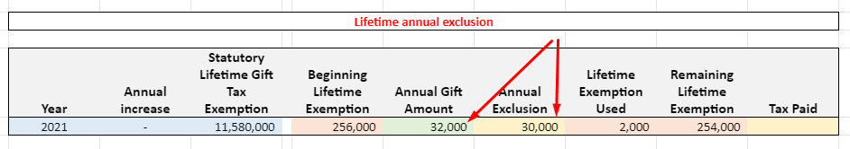

###### Scenario 4

Giftor has given a gift of `16,000` to one individual for 2016. `Gift Amount` is greater than `14,000` so `Annual Exclusion` is set to `14,000`.  The summary tab for this Giftor will appear as below

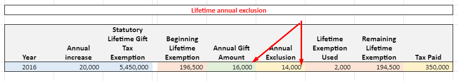

##### When user gives a gift less than 15,000 to an individual in a single year, the value of `Gift Amount` will be set to `Annual Exclusion`. 

###### Scenario 1 

Giftor has given a gift of `12,000` to one individual for 2021. Here `Gift Amount` is less than `15,000` so `Annual Exclusion` is set to `12,000`.  The summary tab for this Giftor will appear as below

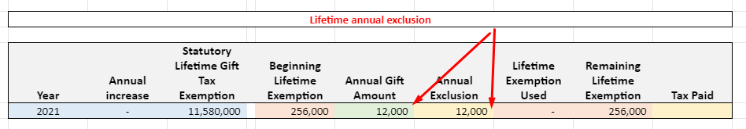

###### Scenario 2

Giftor has given gifts of `10,000` to 5 different individuals. Here the `Annual Gift Amount` is `50,000`. The summary tab for tis Giftor will appear as below where `Annual Exclusion` is set to `50,000`.

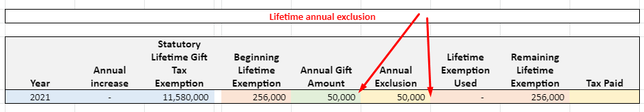

##### Scenario 6 - (Crummey Trust)

###### Step 1

Suppose `Trust T1` is a `Crummey trust` and `I1 (50%)` and `I2 (50%)` individuals are its withdrawal rights. Giftor `G1` has given a gift of `14,000` to  `Crummey trust T1`. Here the gift will be allocated to both withdrawal rights `I1` & `I2` as below.

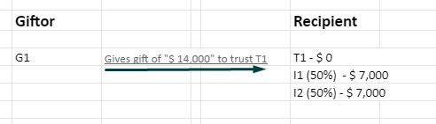

The Summary tab for `G1` will show `Annual Gift Amount` to `14,000` and `Annual Exclusion` to 14000.

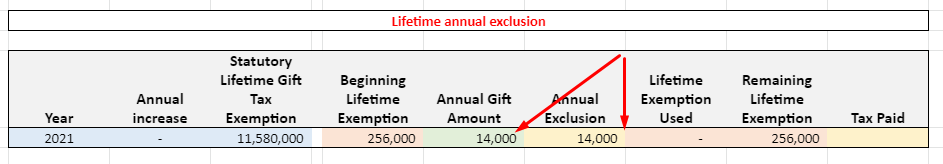

###### Step 2

Giftor `G1` has given another gift of `18,000` to `Crummey trust T1`. Now both `I1` and `I2` individuals will get the `8,000` and T1 will get the `2,000`. This is because any individual can get a maximum gift of `15,000` from the trust. `I1` and `I2` had already received `7,000` in the first Gift so here they only received `8,000`. 

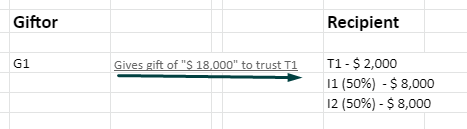

Summary tab for `Giftor G1` will show `Annual Gift Amount` to `32,000` and `Annual Exclusion` to `30000 (15000 of I1 + 15000 of I2)`.

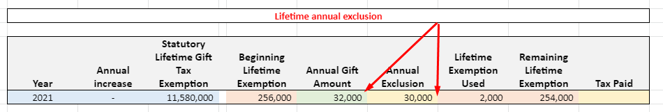

###### Step 3

`Trust T2` is also a `Crummey trust` and its withdrawal rights are also `I1` and `I2` individuals. Now `G1` has also given two gifts of `14,000` and `18,000` to `T2` same as above. Here also allocation will be done the same as above step 2.

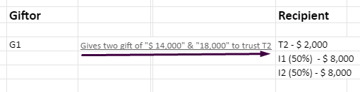

Now Total Gift by G1 in a year is allocated as below

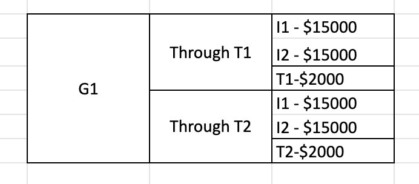

Now Summary tab for `G1` will show `Annual Gift Amount` to `64,000` and `Annual Exclusion` to `30000` (Because each giftor can only gets 15,000 per individual)

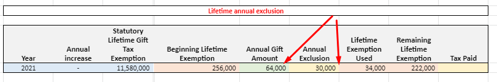

##### Scenario 7 (Non Crummey Trust)

One Giftor `G2` has given a gift of `10,000` to `Non - Crummey trust`. Summary tab for G2 will show `Annual Gift Amount` to `10,000` and `Annual Exclusion` to `0`.

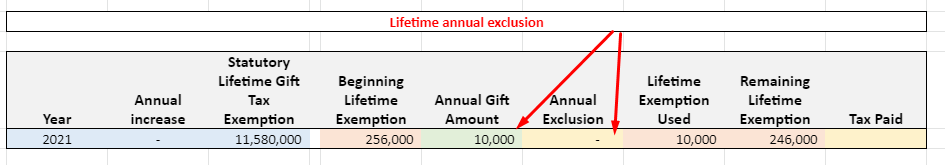

##### Scenario 8 (Direct Gift + Gift through Crummey Trust)

Giftor `G3` has given a direct gift of `8,000` to one individual I3. G3 has also given a gift of `8,000` to `Crummey trust T3` whose withdrawal right is solely I3. 
So here G3 has given a total `16,000` to I3. 8,000 as a direct gift & 8,000 via T3 gift. The Summary tab for G3 will show `Annual Gift Amount` to `16,000` and `Annual Exclusion` to `16,000`.

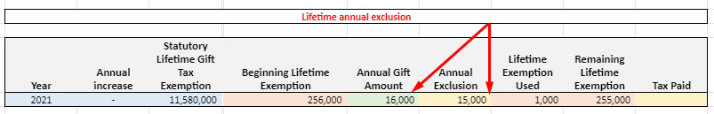

#### Exception

Annual exclusion is not always set by system . There is one case where system won't set Annual Exclusion auto. 

When any user has set the exclusion manually from the tax return page, then the system will never override it. If the user deletes that tax return, the system will continue to auto-set the value of `Annual Exclusion`.

##### Scenario

Giftor has given a gift of `25,000` to one individual for 2021. Here `Gift Amount` is greater than`15,000 ` so `Annual Exclusion` is set to `15,000`.  The summary tab for this Giftor will appear as below

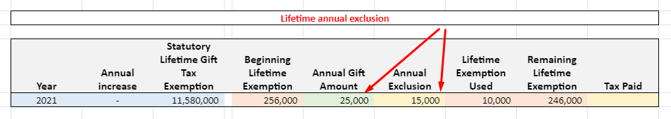

Now suppose the user has edited the manual `Annual Exclusion` value from the tax return page from `15,000` to `22,000`. Summary tab will appear as follows.

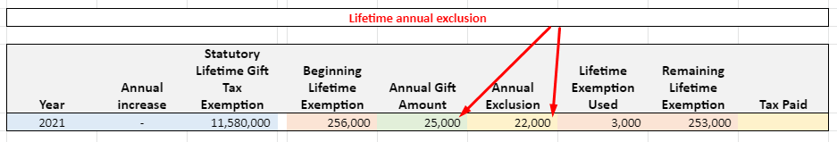

Now suppose the user add another gift `5,000` to same individual for same year. System will not update the `Annual Exclusion` (Consider `22,000` was entered manually by user) and summary tab will be as following.

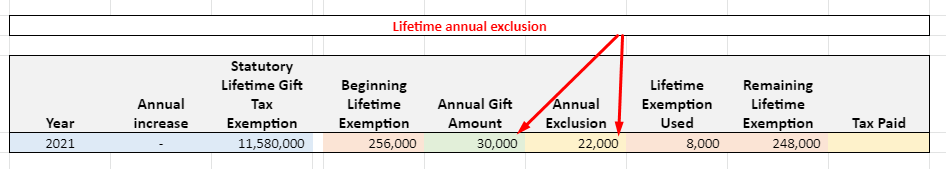

Now suppose the user delete that tax return. System will update the `Annual Exclusion` to `15000` because `Annual Gift Amount` is greater than `15000`. So summary tab will be as following.

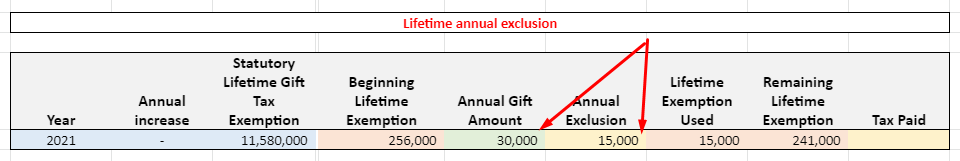

## GST Gifts are considered as subset of Lifetime Gifts

- Suppose if a user enters `Annual Lifetime Gift` amount `50,000`, then the system will only allow to enter any value which is less than or equal to 50,000 in `Annual GST Gifts`.
- If the user has only entered the `Annual GST Gift` amount, the system will auto set that amount in `Annual Lifetime Gift` amount. 

### Scenario 1: User has entered only lifetime data

Suppose an Individual doesn’t have any gifts. User enters manual data for the year `2016` as shown below. Here the user has entered data only at the Lifetime side. The GST side is empty..

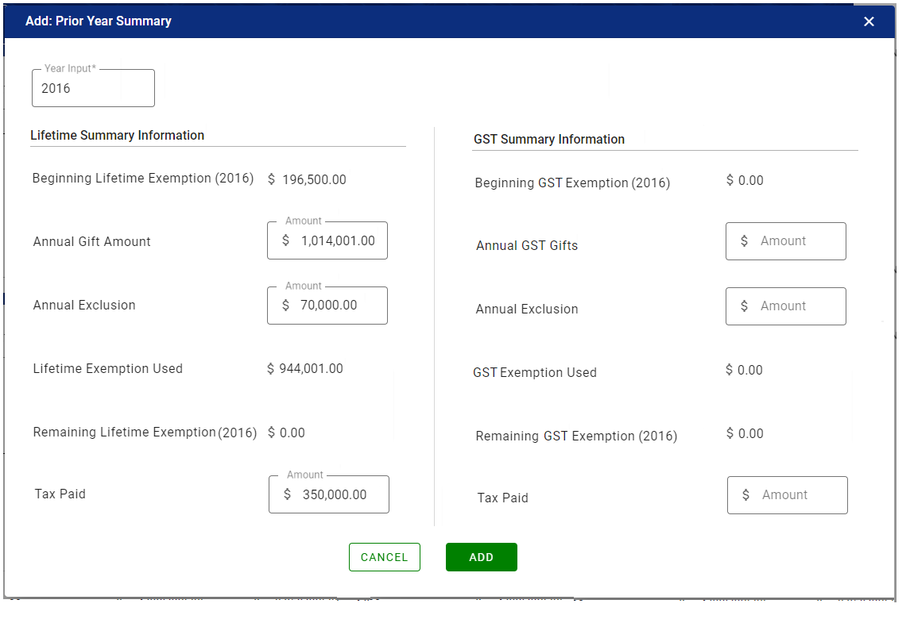

After adding the above manual record, both tabs will look like the below snapshot. Here `Lifetime Summary` tab has one manual record of 2016. Other years entries from 2017 to 2021 are auto-generated and the `GST Summary` tab will show the same year's rows but empty values. 

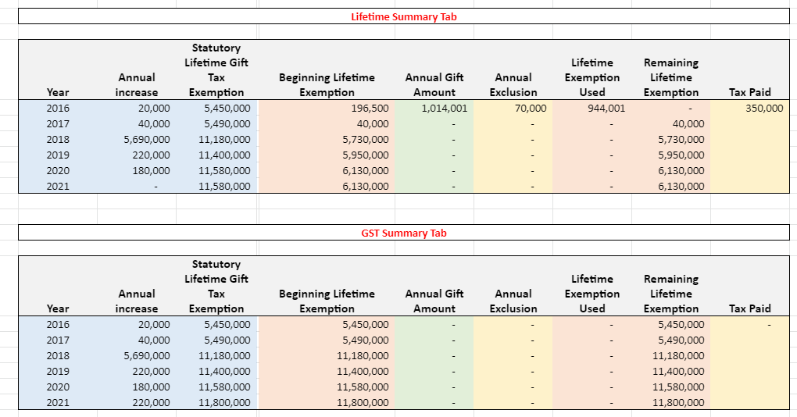

## Browse lifetime Summary 

### UX Rule

- Shows lifetime Exemption summary of particular Individual on year over year basis.
- For Joint legal entity, this page shows data for both individuals.
- It shows the records from smallest year to current year in ascending order
  - For e.g If current year is 2021 and smallest year in which Gift available is 2015, then this page will show records from 2015 to 2021
- For each year, this page shows following columns
  - Year
  - Annual Increase
    - Annual increase by government for this year. 
  - Statutory Lifetime Gift Tax Exemption
    - Total available exemption by this year
  - Beginning Lifetime Exemption
  - Annual Gift Amount
  - Annual Exclusion
    - Pulled from Tax Return for the same year.
  - Lifetime Exemption Used
  - Remaining Lifetime Exemption
  - Tax Paid
    - Pulled “Tax Due” value for the same year.
  - Summary
    - Possible values : Auto, Manual & Pulled
    - Manually added records are called Manual. 
    - Records which are pulled from Gifts Given and Tax return are called Pulled.
    - Records which are auto generated by system to show continuous ledger from lowest year to current year are called Auto.
- From above columns, first 3 columns `Year, Annual Increase & Statutory Lifetime Gift Tax Exemption`  shows figures from Master ledger. All other column values are shown from either Gifts given, Tax return or Manual entry.
- Show `-` if data is not available in a particular column.
- When there isn't any gifts available for any year, shows only one record for current year showing Remaining Lifetime exemption (This is just to show the Remaining Exemption figure. Otherwise for such Individual there isn't any way to see Remaining Exemption)
  - For e.g If current year is 2021 and this Individual don't have any gifts available in any year, then this page will show only one record for 2021
- When no gifts are available for any particular year, then shows  `No Gift tax returns was filed for {Year} year` message in the Annual Gift Amount column
  - for e.g.  Current year is 2021 and smallest year in which Gift available is 2015. User has gifts available in 2015, 2016, 2017 & 2020.  This page will show records from 2015 to 2021. On this page for the years 2018, 2019 & 2021, it will show message like `No Gift tax returns was filed for 2018 year`
- When `Tax Return` is available for any particular year, shows proper message in `Lifetime` and `GST` summary tab.
  - Message for `Lifetime Summary` tab: `Gift Tax return was filed, but no gifts were available`
  - Message for `GST Summary` tab: `Gift Tax return was filed, but no gifts were GST Exempt`.
- For Auto and Manual records, shows Edit action
- For First record shows Delete action. Delete is only available if first record is of type `Manual`.
- On click of `Pull` types records, redirect users to the `Given` tab where `From`, `To` and `Gift Type` filter are applied. 
  - There is one case : Suppose gift is not available for `2021` but a tax return is available. That means summary tab will shows records from `2012` to `2021` where `2012` is a pull type records and other records are set to `Auto`. When user clicks on the `2012 (Pull type)`  records then system redirect users to the `Given` tab where given tab is empty.
- Once the user manually changes the `Annual Exclusion` in the tax return, the system stops the calculation.
- For `Joint` entity, shows `Lifetime Summary` and `GST Summary` of both individuals.

#### UI Rule

- Mockup: No Gifts available for Individual //TODO
- Mockup: Page with some records available //TODO
- Mockups: for Joint //TODO

## Auto Add/Delete Summary records

System Auto add records to show continuous ledger when required.

> Suppose I have added a manual record for the 2002 year. So the system will auto-create records from 2003 to 2021 (Current year) in the summary tab. The type of records created by the system will be `Auto` and the type of records created by the user will be `Manual`.

When the user manually deletes the first manual records of the Summary tab, the system will auto-delete all subsequent `Auto` type records.

> Now if the user deletes the first `Manual` records of 2002, the system will auto delete all the `Auto` type records up to 2020 (Current year -1).
>
> In the above example, suppose I have a record for 2015 that is pulled from the gift and now if the user deletes the 2002 records, the system will auto-delete all the `Auto` type records only up to 2014. 2015 record is pulled so the system will not delete it  and that's why summary tab will show records from 2015 to 2021.
>
> Similarly, in above case if I have manually added records for 2015 (Instead of pulled), the system will not auto-delete records from 2015 to 2021.

