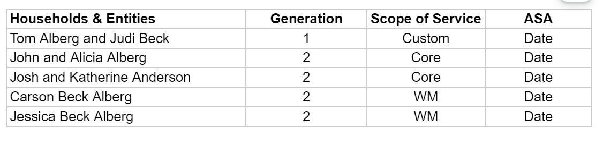

# ASA details
## Overview
- Each of entities that has signed an Advisory Service Agreement (ASA) with Clarius, making them a client in their own right. For a Joint, both two Individuals sign the same agreement.
- Example, for Alberg-Beck family:

## Entity Details
- Effective From 
  - It is mandatory field when ASA is set to `Yes`.
  - It is date inpur field.
- Type of Agreement
  - It is mandatory field when ASA is set to `Yes`.
  - Its drodpown values are: `Consulting`, `Consulting with Investment Services`, `Friends & Family`, `Standard`, `Donor Advised Fund`, `Donor Advised Fund - Managed` & `Minor`.
- Version
  - It is mandatory field when ASA is set to `Yes`.
  - It shows Versions of the selected `Type of Agreement`.
  - It pulls from the `ASA Version` of the Admin console. 
  - It shows the current version of the selected type. (Latest version is shown at top)
  - Not applicable for `Donor Advised Fund`, `Donor Advised Fund - Managed` & `Minor` ASA type. 
- Householding
  - It is dropdown of `Yes` & `No`. Default it is `No`.
- Select Householding
  - Applicable only when `Householding` = Yes 
  - This field doesn’t have a label. It has only placeholder text.
  - It is a dropdown of `Household` & `ASA Entity = Yes` of the family. 
  - Shows Generation at prefix of household name and shows `Household` & `ASA Entity = Yes` icon at suffix.
  - On hover of icon, shows tooltip message. [See more details](../ui-components/browse-legal-entity-dialog.md#show-tooltip-message)
- Alternative Payor
  - It is dropdown of `Yes` & `No`. Default it is `No`.
- Select Alternative Payor
  - Applicable only when `Alternative Payor` = Yes 
  - This field doesn’t have a label. It has only placeholder text.
  - It is a dropdown of  `Household` & `ASA Entity = Yes` of the family. 
  - Shows Generation at prefix of household name and shows  `Household` & `ASA Entity = Yes` icon at suffix.
  - On hover of icon, shows tooltip message. [See more details](../ui-components/browse-legal-entity-dialog.md#show-tooltip-message)

## Change ASA dialog
### System Rule
- ASA can be assigned only when entity has `Household` or `ASA Entity` is Yes.
- ASA details is mandatory for Household/ASA Entity = Yes.
- For Entity having ASA entity, if the entity's `Service Team` doesn't have an ASA and the entity ASA is changed from Yes to No, the system will reset the `Portfolio Details`.

### UX Rule
- When the `Effective Date` of entity ASA is less than the effective date of the selected version, system shows warning message at bottom of dialog.

## UI Rule
- [See Flow of ASA assign](https://drive.google.com/drive/u/0/folders/1CKcnBPDCcnS-OLMpQ2OUks5EImZG4M3A)
- Warning message: `ASA Effective Date is prior to the version's Effective Date ({Effective date of the version}).` [See this](https://drive.google.com/file/d/1ibeJMz-mZ8hVU-P8ju4jcleiEU3pAeOf/view?usp=sharing)

## Amend ASA
### System Rule
- ASA can be amended only when it has at least one ASA version.
- When amend the ASA, `Effective From` date of the new ASA version will always be greater than the `Effective From` date of the last ASA Version.
- When amend the ASA, system will also amend the Fee details. 

### UX Rule
- When `Effective From` is not greater than latest historical ASA, system shows error message in the `Effective From` field.

### UI Rule
- [See flow of Amend ASA](https://drive.google.com/drive/u/0/folders/1yiqkuv3NNK82nDOOfh60-hNYEw_EeIJw)
- Error message: `It always > {Latest version Effective From}`. [See this](https://drive.google.com/file/d/1wAKM7kePyTNJSbwKI7lstSz7mrLNlD3h/view?usp=sharing)

## Browse ASA details
### UX Rule
- This section is applicable only when `Household` is Yes or `ASA Entity` is Yes.
- On hover of section, shows pencil icon to the right side of the header. On click, opens the ASA Details dialog.
- Shows `-` when data is not available in `Effective From`, `Type of Agreement` and `Version`.
- If ASA is not set, shows pencil icon otherwise shows vertmore action.
  - Vertmore action: `Edit`, `Amend`
    - On click of `Edit` action, opens the `Edit` dialog.
    - On click of `Amend` action, opens the `Amend` dialog with empty fields.
- When any entity has both `Current` and `History` records, shows ASA details in 2 tabs: `ASA Details` & `History`
  - Default `ASA Details` tab is selected.
- Current ASA details is shown in the `ASA Details` tab. `Historical` ASA details is shown in the `History` tab.
- When `Householding` & `Alternative Payor` both are `No`, it won't be shown in the ASA details section.

**History tab**
- Columns for `History` tab
  - Effective From
    - It shows the Effective Date of the Historical Version. For e.g. Suppose Individual `I1` has one ASA version and its Effective date is `Jan 1, 2021`. Now user amend that version and add a new version whose Effective date is `Mar 3, 2023`. So in this case, the first version will be moved to the History tab. So in the history tab, the `Effective From` column shows `Jan 1, 2021` and the `End Date` column shows `Mar 2, 2023`.
  - End Date
    - It shows the `{Effective From of added new version - 1}`.
  - Type of Agreement
    - It shows type.
  - Version
    - It shows version
    - For `Donor Advised Fund`, `Donor Advised Fund - Managed` &  `Minor`, shows `N/A`.
- On hover of records, shows hover effect and vertmore action. Vertmore action: `Delete`
- On click, opens the view dialog of ASA. 
- Records are shown in the descending order of the `Effective From` date. (Latest records will be shown at top)

### UI Rule
- [Mockup of ASA details tab](https://drive.google.com/file/d/1ZwCmy0XWX9ytGqghzF40L2rXbFY3Fnee/view?usp=sharing)
- [Mock up of history tab](https://drive.google.com/file/d/1IacPH5W82SlIYunkfMxyNwQoUTYWYFGc/view?usp=sharing)

## View ASA dialog
## UX RUle
- Applicable only for Amended ASAs.
- Shows `Household/ASA Entity` & `Alternative Payor` as link. On click, open that entity in new page.
- Show `Delete` action at right side of the header. On click, open detele confirmation diaog. 
- Column of the Fee Details table
  - From 
  - To
  - Frequency
  - Fixed Fee
    - Shows `Yes/No`.
  - Annual
  - AUM Fee
    - Shows `Yes/No`.
  - Type
  - Discount
    - Shows `Yes/No`.
  - Percentage
  - Minimum Annual Fee
    - Shows `Yes/No`.
  - Amount
- Shows `-` when data is not available for any column. 
- Records are shown in the descending order of the `From Date`.
- Show proper message when no records available in fee details section.

## UI Rule
- Placeholder text: `No Fees Available`

## Fee Details
### Overview
- Sometime user wants to track fee details of the each household which has ASA. So here, he/she can add fee details.

### Entity Details
- From Date
  - It is mandatory and date input field.
- Frequency
  - It is mandatory field.
  - Values are: `Monthly`, `Quarterly`, `Half Yearly`, `Yearly`
  - Default `Quarterly` is selected.
- AUM Fee
  - It is dropdown of `Yes` & `No`. Default it is `No`
- Type
  - It is mandatory when `AUM Fee` is Yes.
  - It is dropdown of `Standard`, `Custom`, `Legacy`
  - Default no any value is selected.
- Discount
  - Applicable only when `Type` is `Standard`.
  - It is dropdown of `Yes` & `No`. Default it is `No`
- Percentage
  - It is mandatory when `Discount` is Yes.
  - It is percentage input field. Decimal value is allowed.
- Fixed Fee
  - It is dropdown of `Yes` & `No`. Default it is `No`
- Annual
  - Applicable only when `Fixed Fee` = `Yes`
  - It is mandatory and amount input field. Decimal is not allowed.
- Minimum Annual Fee
  - It is dropdown of `Yes` & `No`. Default it is `No`
- Amount
  - Applicable only when `Minimum Annual Fee` = `Yes`
  - It is mandatory and amount input field. Decimal is not allowed.
- Notes
  - It is a free form text input field.

### Add Fee Details
#### System Rule
- Can be added only when `ASA` of the entity is Yes.
- When user change `Household/ASA Entity` to No, system will auto remove the data of `Fee Details`.

#### UX Rule
- `From Date` always greater than the last record `From date` otherwise the system shows error.
- When the `From Date` of entity is less than the `Effective From` date of the selected version, system shows warning message at bottom of dialog.
- When user enter invalid percentage, system shows error message.

#### UI Rule
- [See flow of Fee details](https://drive.google.com/drive/u/0/folders/17pOoOzNKnTN0LtgJg-rSNQ-5HSFTgU--)
- Warning message: `Date must be >= {last records From date}` 
- Error message for Percentage: `It should be <= 100`.

### Edit Fee Details
#### System Rule
- Only current ASAs Fee details can be edited. (Amened ASAs fee details can't be edited)

### Browse Fee Details
#### UX Rule
- This section is applicable only when Entity has `ASA`.
- Show `+` icon to the right side of the header. On click, opens the Fee details dialog.
- Shows proper message when no records available.
- Columns
  - From 
  - To
    - It shows the `{From date of added new version - 1}`.
    - For current records, shows `Current` word.
  - Frequency
  - Fixed Fee
    - Shows `Yes/No`.
  - Annual
  - AUM Fee
    - Shows `Yes/No`.
  - Type
  - Discount
    - Shows `Yes/No`.
  - Percentage
  - Minimum Annual Fee
    - Shows `Yes/No`.
  - Amount
- Shows `-` when data is not available for any column. 
- Records are shown in the descending order of the `From Date`. (Latest records will be shown at top)
- New record will be always added to the top.
- On hover of each records, shows vertmore action to the right side.
  - Vertmore action: `Edit`, `Delete`
    - On click of `Edit` action, opens the `Edit` dialog.
    - On click of `Delete` action, opens the `Delete` confirmation dialog.

#### UI Rule
- Placeholder message: `No Fees Available`
- [Mockup of ASA details tab](https://drive.google.com/file/d/1t1rueL01SlS9HT5MoRz0BHZUoYBafUwC/view?usp=sharing)
- [Mock up of history tab](https://drive.google.com/file/d/12ZzlJtODoDd2Z1NNNgX4vJmrLjGMV5CN/view?usp=sharing)

### Delete Fee details
#### System Rule
- Can be deleted only current ASAs fee detail.

#### UX Rule
- On delete, open delete confirmation dialog. On confirmatio, record will be delete.