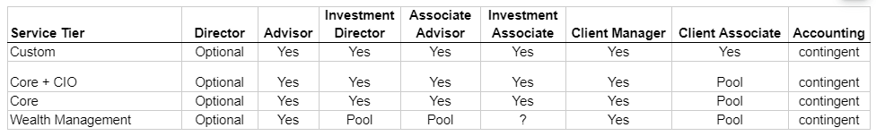
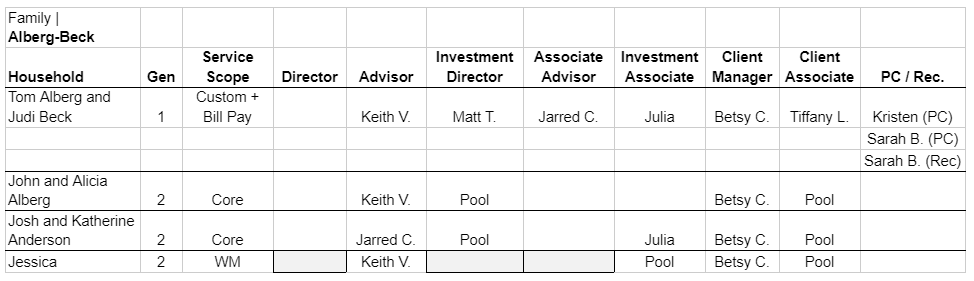

# Household Team
## Overview
- Previously, everyone in the family was covered by the same Clarius team. But now, teams are defined at a Service tier level.

A single Family could consist of multiple Households, each at different Service Scope.  Concepts like the “Family Team” will become obsolete: nothing will get rolled up to the family level.
See Alberg-Beck family with household team
.

Investment Role: It means the `Investment Director`, `Investment Associate` & `Operations` role.
Accounting Role: It means the `PC/Rec` role.

## Assign Household Team
### System Rule
- Can be added only for entities having households or `ASA Entity` whose have Own team.
- Only Advisor role is mandatory. 
- When any entity will have a `Portfolio`, `Investment roles` are mandatory.
- When any entity will have `Bill Pay` services, PC role is mandatory. 
- Same user can't be added in same role but it can be added in different role.
- For other entities having `Service team`, team pulls from the Household.
- When Individual is part of any Joint Household, household team of Individual will be same as the Joint. (It doesn't matter Individual has Bill Pay service or Portfolio)

### UX Rule
- When any entity has no `Bill Pay` service or `Portfolio`, Household team dialog doesn't show `Investment` or `Accounting` role.
- Same user can't be added in same role but it can be added in different role.
- If the family has more than one user then at least one user is mark as lead otherwise system shows error message.
- When no `Client Associate` is selected, it shows `CA Pool` to convey that tasks will be assigned to `CA Pool`.
- `Reconciliation` role is only available if `Bill Pay` service is selected for the entity.
- When entity has Trigger and user change the `ASA Entity` from No to Yes and select `Own` Service team or change `Household` from No to Yes, system will asks the household team from the bottom of the dialog.

### UI Rule
- [Mockup](https://drive.google.com/file/d/1rVFv9xcDEVFDGk8x2-7wCRN-wpn4tZnX/view?usp=sharing)
- Error when same user is added in same role: `Duplicate value is not allowed`. [See this](https://drive.google.com/file/d/1x080REURjrqqyLlcLhxbQHExtnK2MJ3K/view?usp=sharing)
- Error when any users is not marked as lead: `At least one user should be marked as lead`

### Mark as Lead
#### System Rule
- `Mark as Lead` is applicable for all roles having more than one users. 
- At a time, only one user can be marked as lead. 

#### UX Rule
- Each roles having more than one users has a checkbox and this checkbox is exclusive. Exclusive checkbox means that at a time only one of the values is true.

#### UI Rule
[Mockup](https://drive.google.com/file/d/1aenwBcT9Gf7A0I96_nxRhX_SRz9-FbjM/view?usp=sharing)

## Change Household Team
### System Rule
- Can be changed anytime.
- When user change role, system will update the Team of all other entities where it is pulled.
- When user change role, system will update all existing tasks/triggers of own entity and all entities where this is added as `Service Team`. 

## Browse Household Team
### UX Rule
- For Household entity, 
  - On hover of the section, shows pencil icon to the right side of the header.
  - Shows pencil icon disable until `Service Tier` is selected. On hover, shows tooltip message.
  - Shows proper message when `Service Tier` is not selected. 
- When `Household team` is pulled from the Service team, shows `(Pulled from the Service Team)` word in bracket of header. For e.g. `Household Team (Pulled from Service Team)`. [See this](https://drive.google.com/file/d/1EOzxMhN70ng-rcMdhxOhsMh-Z64MZ0I1/view?usp=sharing)
- Shows tick mark icon for user marked as a lead. `Mark as Lead` user shown first in alphabetically in the roles columns and then the other user is alphabetically sorted. 
- Shows `-` when no role available.
- Due to width problem, shows first name and initials for last name. For e.g. `Keith V.` or `Sue S.`
- `Personal Controller` and `Reconciliation` types role will be shown together.
  - User are primary sorting on users role and secondary sorting on alphabetical order.
  - `Personal Controller` types roles are shown first and `Reconciliation` types role are shown second.
  - Show role name in bracket with each user name. E.g Arun Kumar (PC) or Keith Vernon (Rec.)

### UI Rule
- [Mockup having household](https://drive.google.com/file/d/1aVfUUdpk7KZm5oq6PvdB_9TpElhSZsNb/view?usp=sharing)
- Placeholder message: `No Household Team Selected`
- Tooltip message when pencil icon is disabled: `Select Service tier first`