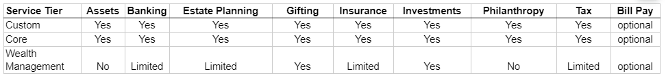

# Scope of Service

## Overview
- To standardize service offerings across the Clarius client base, a concept of Service Scope is introduced that determines which services are available to a particular Household.
- The system will allow for exceptions: specific Households will be offered specific services that are not normally available under the Service Scope associated with that Household.
- Historically there has been a problem with Clarius “over-servicing” some of their clients, by providing more services than they are contracted to, and which they may not even be appreciative of; this mismatch is holding back Clarius’ profitability.
- To minimize this, a concept of Service Scope will be introduced to further standardize the Clarius offerings; Athena Admin can edit a table that determines which services are included in each Service Scope:

**Wealth Management**
- Currently includes ~25 families with $5-15MM assets under management (AUM).  $5-15MM AUM is the largest high-net-worth (HNW) segment even if it isn’t Clarius’ largest segment. There are many competitors in this segment and this segment is already seeing a proliferation of AI-supported “robo-advisors”.  

**Core Family Office**
- Currently includes ~50 clients with $10-100MM AUM.  They generally receive the full suite of Clarius services, including new services that may be offered in the future.
- Competitors in this segment include other Shared Family Offices like Clarius.  Big banks market that they have family office services, but they rarely do.

**Custom Family Office**
- Currently includes ~5 clients with $100MM+ AUM.  They will receive all Clarius services, but more importantly can request support for any other activity they want for their personal or professional advancement.
- Examples of bespoke services for this Service Scope might include establishing residency in another country, or managing aircraft.  Something like establishing foreign residency will be treated as a special project, given its complexity.

**Investment Only**
- A small number of clients with more specific/extensive investment needs (out of the ordinary), will also have Enhanced Investment Services. There are currently 4-5 clients that would fit in this tier.

## Entity Details
- Service Tier
  - It is mandatory. Its values are: `Core`, `Custom`, `Investment Only`, `Investments + Tax` & `Wealth Management`. 
  - Default no any option is selected.
- As of Date
  - It is mandatory and date input field.
- Additional Services
  - It have 3 checkbox options: `Bill Pay`, `Enhanced Investments`, `Family Office`  

## Assign Scope of Service
### System Rule
- Can be added for entities having households or ASA Entity is Yes.
- Can't be added for Deceased/terminated entities.
- Can't be set for entities having `ASA Entity` or `Household` is No.
- For other entity's having `Service team`, it pulls from the Household.
- When the household doesn't have a `Household Team` and the user selects the `Bill Pay` service, the system will allow Bill Pay service without an Accounting role.
- For entity having household, when `Bill Pay` service is selected and entity has no Accouting role, dialog ask the missing accouting role.
- For entity having service team, 
  - When Service team won't have Accounting role, `Bill Pay` service can't be set for the entity.
  - When Service team will have Accoutung role and user selects `Bill Pay` service, system will pull Accounting role from the Service team.

### UX Rule
- In Additional Serices, user can select more than one option. 
- Service Tier drodpown is alphabetical sorted.
- For entity having service team, 
  - When the service team doesn't have Accounting role, system shows error message. 
  - When system pulled the Accouting role from the Service team, system shows proper hint message.

### UI Rule
- [See this flow](https://drive.google.com/drive/u/0/folders/112YdRLkZGV_FJLAXVld8PTqH2AZejWMy)
- Error message: `This entity's Service team doesn't have Accounting roles` //TODO
- Hint messsage: `System will auto pull Accounting roles from the selected Service team` //TODO

## Change Scope of Service
### System Rule
- Can be changed anytime.
- `Service Tier` can't be removed
- When a user changes any details of the `Scope of Service`, the system will auto change the other entities wherever household is used. 
- When `Bill Pay` service is remove, system will auto remove the Accounting role from Household team.
- When a household has a `Bill Pay` service and is used as a service team in another entity that has a Bill Pay service, the system will restrict to remove the Bill Pay service for the household.

### UX Rule
- System shows proper hint message when Accounting role is removed.
- System shows error message when Bill Pay service of Household is resticted.

### UI Rule
- Error message when Bill Pay service is restricted: `You can’t remove Bill Pay because this entity is used as Service team in other entities and it has Bill Pay`. //TODO
- Hint message when Accounting role is removed: `You have removed Bill Pay service. So system will auto remove the Accounting role`
- [See this when UI ask missing role](https://drive.google.com/file/d/1TRuee661EmJW98Q3S4Qwd1rds-Ky3G_u/view?usp=sharing)

## Browse Scope of Services
### UX Rule
- This section is applicable only when `Household` is Yes or `ASA Entity` is Yes.
- Shows `-` when no tier is selected.
- For each `Additional Services` is shown in new line.

### UI Rule
- [See mocks](https://drive.google.com/file/d/1aVfUUdpk7KZm5oq6PvdB_9TpElhSZsNb/view?usp=sharing)
