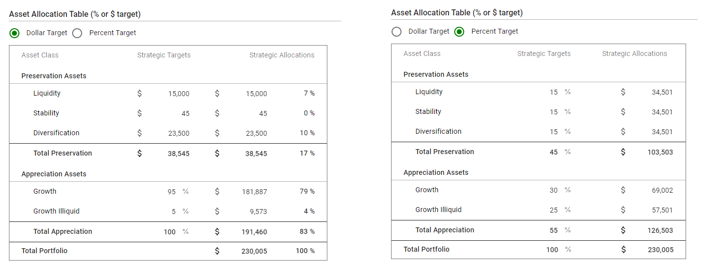
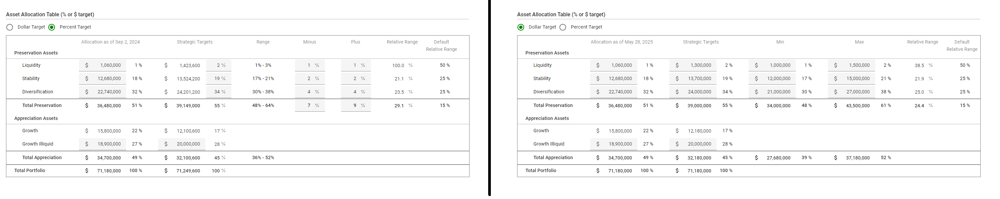

# IPS

## Overview

- Its a short form of Investment Policy statement. Its a overview of the investment policy finalized for that legal entity
- Possible actions: `SAVE AS DRAFT`, `Edit`, `Amend`,  `Delete`, `Download PDF`

## Entity

### `IPS` Entity

| Field Name                               | Description                              |
| ---------------------------------------- | ---------------------------------------- |
| Date                                     | Date input field. Its a mandatory field. Default shows today's date. |
| Client Review                            | allows to select Meeting or Note where this IPS is discussed         |
| Notes                                    | Multiline text input                     |
| Introduction and Purpose                 | Rich text input                          |
| Account Value Table                      | Shows `Entity` wise total value. Entity can have multiple `Account` See below [Account entity](#account-entity) for detail of `Account` Each `Account` can have value. Total value of Entity is total of  each `Account` under that `Entity`  Does not allow decimal in Value. |
| Investment Objectives                    | Rich text input                          |
| Management and Oversight                 | Rich text input                          |
| Portfolio Constraints and Considerations | Rich text input                          |
| Asset Allocation                         | Rich text input                          |
| Asset Allocation Table                   | See [Asset allocation table fields](#asset-allocation-table-fields) |
| Investment Principles and Asset Class Roles | Rich text input                          |
| Investment Policy Review and Amendment   | Rich text input                          |

### `Account` entity

| Field name                      | Description                              |
| ------------------------------- | ---------------------------------------- |
| Entity                          | Name of the Entity                       |
| Account Name*                   | Free form Text field                     |
| Account Open Date               | Date input. Default show today's date.   |
| Account Close Date              | Date input                               |
| Custodian                       | Free form Text field                     |
| Last 4 digits of Account number | Number input. Allows to enter only 4 digits |

## ADD

### System Rule
- When first time IPS is created, system make entry in history.
- User can able to link a meeting/notes from the `Client Review` section for the current or Historical IPS.

### UX Rule

#### Client Review
- Shows + button to the right side of the header. On click, opens a dropdown of the `Meeting` & `Note`.
- Meetings are shown first and Notes are shown second. In meetings or notes, latest meeting/notes will be shown first.
- Shows proper message when no meeting/notes available.
- Duplicate meeting/notes won't be allowed.
- Meeting/Notes dropdown shows meeting/note date and meeting/note name with seprated by pipeline. For e.g. `Sep 6, 2022 | Weekly Meeting`.

### UI Rule

[Mockup](https://drive.google.com/file/d/1of4dodH4OLh9b6aB-oA4vEa-httZP446/view?usp=share_link) 
- Error message: `Duplicate value is not allowed`

## SAVE AS DRAFT

- While creating new IPS, Amend or Edit IPS, it can be  saved as draft
- SAVE AS DRAFT is only possible when IPS not in active state (Here active state means not in draft)
- Should be used when your work is partial but you want to save your work

## Edit

- Current IPS or IPS from history can be edited anytime.
- When you want to do changes in current IPS without making entry in history, you should `Edit current`

## Amend

- When you want to update IPS and want to maintain its history then `Amend` action should be used
- System maintains history of each amendment 

## Delete

- Any record in IPS history can be deleted.

## View

- Client Review
  - Shows meeting/notes from the View IPS. Format of representation: `Meeting or Note: {Meeting date or Note date}| {Meeting name or notes name}`.
  - Meeting and Notes are link. On click, opens a meeting or note view page in a new tab.
  - If meeting or notes is too long, shows ellipsis. Never shows it in next line.
  - If no meeting/Notes available, shows `-`.
  - Sorting order:
    - Meeting are shown first and then shown notes.
    - Under each section, latest meeting/notes are shown first.

## Download PDF of IPS

- Allows to Download PDF file for any IPS in history as well as current.

### PDF file

- File name: 
  - Current IPS: `{legal-entity-name}-ips-report.pdf`
  - Historical IPS: `{legal-entity-name}-historical-ips-report.pdf`
- Message when no data available for any section: `Not Available` 
- Message for Account Value Table: `No Entity Available`
- Some of the sections will start from a new page and some of the sections will start from the same page.
  - Section name that starts with a new page: `Introduction and Purpose`, `Investment Objectives`, `Portfolio Constraints and Considerations`, `Asset Allocation`, `Investment Principles and Asset Class Roles` & `Investment Policy Review and Amendment`.
  - Section name that start from the same page: `Account Value Table`, `Management and Oversight` &  `Asset Allocation Table`. 
- Notes section is not applicable in PDF.
- `Client Review` section is for athena users only. So these section won't be printed in PDF.
- Shows footnote with Asset Allocation table for both Percent and Dollar target.
  - Notes for Percent: `Percent/Dollar targets and rebalancing bands are established for Preservation, Liquidity, Stability, and Diversification. Remaining percentage targets and dollars then flow to appreciation with the option to set a fixed dollar-target to growth illiquid. Any remaining percent/dollars then flow to growth assets.`
  - Notes for Dollar: `Percentage totals may not sum to 100% due to rounding.`.

[Sample PDF of Current IPS - Dollar Target ](https://drive.google.com/file/d/1M0snCCvB3Cas7MDCiclcKpzMV-Lp7eRt/view?usp=share_link)

[Sample PDF of single Historical IPS - Percent Target](https://drive.google.com/file/d/1rUEzilSTj0lK7BHlN5MkTRbHY6q-0ZaS/view?usp=share_link)

## Download PDF of IPS History table

- Allows to download PDF file for IPS History table
- PDF icon won't be applicable for IPS history when the tab has no records available.

### PDF file

- Downloaded file name: `ips-history-of-{legal entity name}.pdf`
- Sorting order of `IPS History` table is the same as the [UI app](#history).
- Sample [PDF file](https://drive.google.com/file/d/1M5ptkCTdd3g8-4nyxrwJWKhCsr_ocefR/view?usp=share_link)

## Asset allocation table fields

- Pulls the total amount of `account value table`. 
- Table can have two input mode: `Dollar Target` & `Percent Target`
  - When table input mode is `Dollar Target`, `Total Appreciation` percentage in `Strategic Targets` column should be 100. Otherwise shows error: `Total percentage must be 100`
  - When table input mode is `Percent Target`, `Total Portfolio` percentage in `Strategic Targets` column should be 100
- If IPS date is less than `01/01/2023`, system shows new table. Otherwise system shows old table.

### Old table

**Dollar & Percent Target**

- Based on the date of IPS, shows field names of the Assets allocation table in `Add` or `Amend`
- If the IPS date is less than the `01/01/2020`, `Asset Allocation table` shows the old field name otherwise shows new field name.

|                         | Before 01/01/2020 (Old fields name)      |  After `01/01/2020` (New field name)      |
| ----------------------- | ---------------------------------------- | ----------------------------------------- |
| **Preservation Assets** |                                          |                                           |
|                         | Cash: liquid cash reserves               | Liquidity                                 |
|                         | Stability: short-term bonds              | Stability                                 |
|                         | Low Growth: high-grade bonds, other debt investments, lower-volatility strategies | Diversification                           |
| **Appreciation Assets** |                                          |                                           | 
|                         | Growth: global public equities           | Growth                                          | 
|                         | Private Capital: private capital partnerships or direct private investments | Growth Illiquid                           |

- For e.g. 
  1. Suppose any IPS is created on 11/01/2019, it will show old field names
  2. Suppose any IPS is created on 11/01/2019 and its amendment is created on 12/01/2019. During Amend It will still show old field names in table.
  3. Suppose any IPS is created on 11/01/2019 and its amendment is created on 07/14/2020. During Amend It will still show new field names in table.
  4. Suppose any IPS is created on 02/15/2020, it will show new field names
  5. Suppose any IPS is created on 11/01/2019 and its amendment is created on 07/14/2020. During Amend It will still show new field names in table.

### New table

**Dollar & Percent Target**

[See the excel file of above all images](https://docs.google.com/spreadsheets/d/1eO3phSZCu6jQasrIgEcaS0CUpM4DQp8N/edit#gid=450171827)

**Allocation as of {Date of IPS}**
- For `Dollar Target` & `Percent Target`, it is a `$` amount input field. System will auto calculate the % from the user input value.
  - Formula of `%` = `{Enter amount of $} * 100) / {Total of Account value table}`. Shows round off value.
  - Shows total of `$` & `%` at last of `Presevation Assets` and `Appreciation Assets` sections. Shows total of both section at last row of the column.
    - Last total of `$` will be same as the total of `Account value total` otherwise system shows error message.
    - Last total of `%` will be 100% otherwise system shows error message.

**Strategic Targets**
- For `Dollar Target`,
  - Preservation Assets
    - It is a `$` amount input field. System will auto calculate the % from the user input value.
      - Formula of `%` = `{Enter amount of $} * 100) / {Total of Account value table}`. Shows round off value.
  - Appreciation Assets
    - `Growth Illiquid`: It is $ input field. System will auto calcuate the % based on it.  Formula will be same as Preservation assets.
    - `Growth`: Both `$` & `%` are calculated field. 
      - `$`: `Total of Account value table` - `Total Preservation` - `Growth Illiquid`
      - `%`: It will be same as Preservation assets.
    - Shows total of the each column at last.
- For `Percent Target`,
  - Preservation Assets
    - It is a `%` input field. Decimal value is not allowed. System will auto calculate the $ amount from the user input value.
      - Formula of `$` = `{Enter % value} * {Total of Account value table} / 100`.
  - Appreciation Assets
    - `Growth Illiquid`: It is % input field. System will auto calculate the $ from the user input value.
    - `Growth`: Both `$` & `%` are calculated field. 
      - `$`: `Total of Account value table` - `Total Preservation` - `Growth Illiquid`
      - `%`: It will be same as Preservation assets.
- Shows total of `$` & `%` at last of `Presevation Assets` and `Appreciation Assets` sections. Shows total of both section at last row of the column.
  - Last total of `$` will be same as the total of `Account value total` otherwise system shows error message.
  - Last total of `%` will be 100% otherwise system shows error message.

**Range**
- Applicable only for `Percent Target`.
- It is a calculated field.
- Calculation formula of range
  - (`% of the Strategic Target - Minus`) - (`% of the Strategic Target + Plus`)
  - Decimal not allowed. Shows round off value.
- If a user enters `0` for any `Strategic Targets`, the range will be set to `0% - 0%`.
- Range will always be positive. If the value of range is negative then `0% - 0%` value will be shown there.
- Range should be between `0% - 100%`. 
- `Range` won't be shown for Appreciation Assets section. For this section, shows only total at last.
  - Total: `(100 - {Higher value of Total Preservation of Range})%` - `(100 - {Lower value of Total Preservation of Range})%`

**Min**
- Applicable only for the `Preservation Assets` of the `Dollar Target`.
- It is a `$` amount input field. System will auto calculate the % from the user input value. Decimal is not allowed.
-  `%` column won't be visible in the view page or pdf. 
- Formula: `Entered amount in $ / Total of Account value table`
- Shows the total of Preservation & Appreciation section at last row.
- Formula of total Preservation: total of the above 3 row (`Liquidity`, `Stability`, `Diversification`)
- Formula for total Appreciation: 
  - For $ column: `Total of Account value table - Total $-Min of Preservation`
  - For % column: `100 - Total %-Min of Preservation section`

**Max**
- Applicable only for the `Preservation Assets` of the `Dollar Target`. Decimal is not allowed.
- It is a `$` amount input field. System will auto calculate the % from the user input value.
-  `%` column won't be visible in the view page or pdf. 
- Formula: `Entered amount in $ / Total of Account value table`
- Shows the total of Preservation & Appreciation section at last row.
- Formula of total Preservation: total of the above 3 row (`Liquidity`, `Stability`, `Diversification`)
- Formula for total Appreciation: 
  - For $ column: `Total of Account value table - Total $-Max of Preservation`
  - For % column: `100 - Total %-Max of Preservation section`

**Minus**
- Applicable only for the `Preservation Assets` of the `Percent Target`.
- It a % input field. Decimal is not allowed.
- Total of the Minus is also input field.
- It is hidden for View IPS.

**Plus**
- Applicable only for the `Preservation Assets` of the `Percent Target`.
- It a % input field. Decimal is not allowed.
- Total of the Plus is also input field.
- It is hidden for View IPS.

**Relative Range** 
- Applicable only for the `Preservation Assets` of the both target type.
- It is a calculated input field. Only one decimal point is allowed.
- This column won't be visible in the view page or pdf.
- Dollar Target
  - Formula: [`($ of Max) - ($ of Min)` / `$ of Strategic Targets`] * 100 %
- Percent Target
  - Formula: `[(% of Strategic Targets + value of Plus) - (% of Strategic Targets - Value of Minus)] / (% of Strategic Targets)` * 100 %

**Default Relative Range**
- Applicable only for the `Preservation Assets` of the both target type.
- Each of the row will have default %. User can't be changed it.
  - Preservation Asset: `Liquidity - 50 %`, `Stability - 25%`, `Diversification - 25%` & `Total Preservation - 15%`
- It is hidden for View IPS.

#### Asset allocation table data are stored in local

- UI app stores input data in local for both type: `% Target` & `$ Target`. For both type data will be stored separately.
  - Scenario 1: It means, During `Add`, If user enters some data in `% Target` and without saving it, if user goes to`$ Target` it will be shown blank.  Now if user enter data in `$ Target` and again come back to the `% Target`, it will show old data entered in `% Target`
  - Scenario 2: if user has already some data in `% Target` and during `Edit` user enters data in `$ Target` mode. After entering data, if user come to the `% Target`  it will show old data.

## Restore unsaved changes

- System keeps track of changes which are not saved.
- When user leave the IPS page (Add/edit/Amend)  without CANCEL action, System will store unsaved changes in local storage. 
- When user performs any action like Add/Edit/Amend, System will check if there is any unsaved changes available in local storage or not. If any unsaved changes found in local storage, System asks user about restore unsaved changes. On confirmation of user, System restores unsaved changes.

## UX Requirement

See [Mockups](https://drive.google.com/drive/u/0/folders/1xfiUGFYjddQQoArdyN_dbkRwdqXNVIcI)

### IPS Summary

- Shows latest IPS (Doesn't matter its Draft or not)

### Current

- Shows latest IPS (Doesn't matter its Draft or not)

### History

- Shows record in descending order of date
- Current IPS is not shown in history

### Rich text editor

- Default font is Roboto and font size is 16px. Does not allow user to change font or font size

## UI Resources

### Restore Unsaved Changes confirmation dialog

Title: Restore Unsaved Changes?

Message: Do you want to restore your unsaved changes?

Button: No, Yes (`No` button will be outlined & `Yes` button will be filled)

