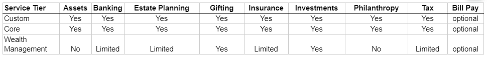
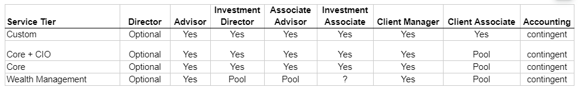
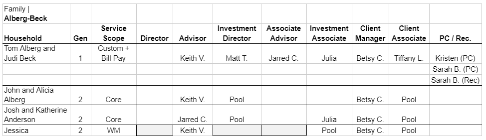
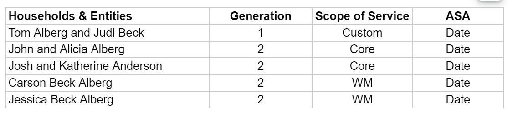

# Assign Household/Service Team

## Household 

### Overview
- In past, every client was considered in the context of a Family. Now, members of a Family will be grouped into Households.
- Every Family will consist of 1+ Households, where a Household will refer to any Individual or Joint that has signed an Advisory Service Agreement (ASA) with Clarius, making them a client in their own right.
- Over time it is possible that an Individual from an existing Household, e.g `Abigail Miriam Alberg`` who is currently in the John Alberg & Alicia Alberg Household, could become a separate client of Clarius upon reaching maturity, thereby establishing a new Household within the Clarius Family.
    - It is not inevitable that all minor Individuals will eventually become Households: e.g. if `Abigail Miriam` becomes a client of a competitor, she would not establish a Household with respect to Athena. (In such situations, the child would still need to be tracked as an Individual in Athena since they will likely be the beneficiary of estate planning for that Household.)
    - A Household may include adults who have not established their own client relationships with Clarius, e.g. `Robert Alberg` within the Tom Alberg & Judith Beck Household. These will remain as Individuals under the original Household.
    - It always requires signing a separate agreement with Clarius to establish a Household.
    - Each Household will have a Service Level Scope; different Households within the same Family may be at different Scope.
- When a new Household is created, a dropdown will allow a Service Scope to be selected for that Household. (All members of a Household will be at the same Scope.)
- Within a Family, different Households may be at different Service Scopes.

### Entity Details
- Household
  - Applicable only for Individual and Joint.
  - It is a radio button. Values are: `Yes` & `No`
  - Default none of the option is selected. 

- ASA Entity
  - Applicable for all entities except Individual & Joint.
  - It is a radio button. Values are: `Yes` & `No`
  - Default none of the option is selected.  

- Service Team
  - Applicable for all types of entity. 
  - For Individual & Joint, applicable only when `Household` is No.
  - It is a dropdown of Household of the family in alphabetical order.
  - If any entity has `Display Name`, shows `Display Name` otherwsie shows legal name.

### Assign Household 

#### System Rule
- Household can be assigned only for active/archive Individual or Joint.
- Can't be assigned for `Deceased/Terminated` Individual or Joint.
- When the user sets the household for a Joint, the system will auto-set the household of the Joint to both Individuals and user cann't change it from the Individual. 
  - Suppose Individuals have their own Household. Now, when user sets household to that Individual's Joint, system will remove Individual's household and auto set the Joint household.

#### UX Rule
- User can assign household from the `Contact` tab and `Clarius Team/Service Scope` tab.
- Shows pencil icon to the right side of the `Entity Details` header. On click, opens the Edit dialog where user can set household.
- Shows pencil icon disable when entity is marked as deceased/Terminated. On hover, shows tooltip message.
- For `Individual`, Shows pencil icon disabled when it has their Joint's household. On hover, shows tooltip message.
- Shows proper message in `Clarius Team` tab when no household or service team is assigned.

#### UI Rule
- [Mockup flow](https://drive.google.com/drive/u/0/folders/17Ff2xnS75P8vtvBbys3SfoOHqHZfJdk8)
- Tooltip message for Individual when Joint have household: `This Individual is associated with Joint. So you can't change household details from here. You can change it at Joint level only`. [See this](https://drive.google.com/file/d/11LgjAFXjUsXe5_GunMv_9j0tk9CjZPvg/view?usp=sharing)
- Tooltip message when entity is marked as deceased/terminated: `This entity is Terminated/Deceased. So you can't change it`. [See this](https://drive.google.com/file/d/1e4LdgYZt31iA7fisnyIGF3Q377hjfXGR/view?usp=sharing)
- Placeholder message in `Clarius Team` tab when there is no household and service team is assigned:
  - Individual & Joint: `No Household/Service Team Assigned`
  - For other legal entity: `No Service Team Assigned`. [See this](https://drive.google.com/file/d/15jcqlUKuJ8W5qlp11lwkT0YI_C53b4MJ/view?usp=sharing)

### Change Household
#### System Rule
- Can't be change until household is used in another entity as a Service Team.
- When user change the household, system will remove `Scope of Service`, `Household Team` & `ASA` details. `Portfolio` details will remain as it is.
- When user change the household and select `Service Team` having ASA details, system won't reset `Portfolio` details.
  - For e.g `Tom` & `Judi` is household and noth has ASA details. Tom is selected as a service team in `Carson`. Carson has portfolio details. Now, user change the service team of Carson from Tom to Judi. System won't reset the Portfolio details of the Carson.
- When user change the household, RACI role of the tasks of the entity will also be changed.
- For Joint, when user change the household from Yes to No, system will remove the `Portfolio Details` of the both Individual.

#### UX Rule
- When household is changed from `Yes` to `No` and it is used in other entities, system shows household change is not possible dialog. 
- When household is not used in any entity and user change its value (Yes to No), system shows a confirmation dialog. On confirmation, system removes the `Scope of Service`, `Household team` & `ASA` details.
- When household is not used in any entity and user change its value (No to Yes), system shows a confirmation dialog. On confirmation, system change the `Household team` details.
- For Joint, when household is change to No, system will remove the household from both Individuals.
- When household is changed from `Yes` to `No` and user select Service team, RACI roles of the entity is changed accordingly.

#### UI Rule
- Change possible dialog: [Yes to No](https://drive.google.com/file/d/1Z7aQ9oqXeEzUsg94vmSehF3gq1JznrUV/view?usp=sharing) or [No to Yes](https://drive.google.com/file/d/1FDGk7CcVx2ikRHVClFE0I_EQJX0CzY4i/view?usp=sharing)
- [Change is not possible dialog](https://drive.google.com/file/d/1w3cnN2Hhi5LQhGDcnXVWIAKT7xp-GNLO/view?usp=sharing) 

## ASA Entity
### Assign ASA Entity
#### System Rule
- ASA Entity can be assigned only for active/archive entities except Individual/Joint.
- Can't be assigned for `Deceased/Terminated` entities.

#### UX Rule
- User can assign ASA Entity detials from the `Contact` tab and `Clarius Team/Service Scope` tab.
- Shows pencil icon to the right side of the `Entity Details` section. On click, opens the Edit dialog where user can assign ASA Entity.
- Shows pencil icon disable when entity is marked as deceased/Terminated. On hover, shows tooltip message.

#### UI Rule
- [Mockup flow of Assign ASA entity and service team](https://drive.google.com/drive/u/0/folders/1ONhZB_gUTKdCIQ1EG0E5TdjUpGXEPf0z)
- Tooltip message when entity is marked as deceased/terminated: `This entity is Terminated/Deceased. So you can't change it`

### Change ASA Entity
#### System Rule
- Can be changed anytime.
- When ASA entity is changed (Yes to No), system will remove `Scope of Service`, all details of `ASA` (Current and History) & `Portfolio Details`.
  - `Portfolio Details` will be reset only when ASA details isn't avaialble for selected service team.

#### UX Rule
- When ASA Entity details is changed from Yes to No, system shows confirmation dialog. On confirmation, system remove the `Scope of Service`, `ASA Details` & `Portfolio Details`.
- When ASA Entity is changed from No to Yes, system show confirmation dialog.  

#### UI Rule
- [See confirmation dialog when ASA entity is changed from Yes to No](https://drive.google.com/file/d/16AJFjE04dv0FgE0wCSgJZSJ7eRL75TLk/view?usp=sharing)
- [See confirmation dialog when ASA entity is changed from No to Yes](https://drive.google.com/file/d/1vm4fr_DhPS6ETRTKST91QIU5UoHkUgm8/view?usp=sharing)

## Service Team
### Overview
- Every legal entity will roll in to any Household. So that it will have team same as team of Household.

### Assign Service Team
#### System Rule
- Can be assigned to all types of active entities.
- When the user selects a household from the `Service Team`, the system will pull the `Scope of Service` and `Household Team` from that household.
- When the user assign the `Service Team` for a Joint, the system will auto-set the `Service Team` of the Joint to both Individuals. User cann't change it from the Individual. 
  - Suppose Individuals have their own Household/Service team. Now, when user assign Service team to that Individual's Joint, system will remove Individual's household/Service team and auto set the Joint Service team.

#### UX Rule
- For `Individual`, Shows pencil icon disabled when it has their Joint's Service team. On hover, shows tooltip message.

#### UI Rule
- Tooltip message for Individual when Joint have Service team: `This Individual is associated with Joint. So you can't change household details from here. You can change it at Joint level only`. [See this](https://drive.google.com/file/d/1IBUe09WomOoGowFnX2Q_j--CEYqmhbhp/view?usp=sharing)
- [See mock for Entities](https://drive.google.com/file/d/1XpSsaK7Mp6pmUqm546Wb6g-5YciTBrbX/view?usp=sharing)
- [See mock for Individual & Joint](https://drive.google.com/file/d/14y8rXM46w2dLncUoY6P6qn8HG5lh1Aey/view?usp=sharing)

### Change Service Team
#### System Rule
- Can be changed anytime.
- When clarius team is changed, system will update the `Scope of Service` and `Household team` details. Other details will remain as it is.
- When entity is marked as Terminated, system will auto-removed the Service team.

#### UX Rule
- When user change the `Service Team`, system will shows a confirmation dialog. On confirmation, clarius team is changed.

#### UI Rule
- [Change confirmation dialog](https://drive.google.com/file/d/1UP4ef0kFZVz3LUGB2Y3vf8IsfLY1IcvR/view?usp=sharing)

## Service Tier
### Overview
- To standardize service offerings across the Clarius client base, a concept of Service Scope is introduced that determines which services are available to a particular Household.
- The system will allow for exceptions: specific Households will be offered specific services that are not normally available under the Service Scope associated with that Household.
- Historically there has been a problem with Clarius “over-servicing” some of their clients, by providing more services than they are contracted to, and which they may not even be appreciative of; this mismatch is holding back Clarius’ profitability.
- To minimize this, a concept of Service Scope will be introduced to further standardize the Clarius offerings; Athena Admin can edit a table that determines which services are included in each Service Scope:

**Wealth Management**
- Currently includes ~25 families with $5-15MM assets under management (AUM).  $5-15MM AUM is the largest high-net-worth (HNW) segment even if it isn’t Clarius’ largest segment. There are many competitors in this segment and this segment is already seeing a proliferation of AI-supported “robo-advisors”.  

**Core Family Office**
- Currently includes ~50 clients with $10-100MM AUM.  They generally receive the full suite of Clarius services, including new services that may be offered in the future.
- Competitors in this segment include other Shared Family Offices like Clarius.  Big banks market that they have family office services, but they rarely do.

**Custom Family Office**
- Currently includes ~5 clients with $100MM+ AUM.  They will receive all Clarius services, but more importantly can request support for any other activity they want for their personal or professional advancement.
- Examples of bespoke services for this Service Scope might include establishing residency in another country, or managing aircraft.  Something like establishing foreign residency will be treated as a special project, given its complexity.

**Investment Only**
- A small number of clients with more specific/extensive investment needs (out of the ordinary), will also have Enhanced Investment Services. There are currently 4-5 clients that would fit in this tier.

### Entity Details
- Service Tier
  - It is mandatory. Its values are: `Core`, `Wealth Management`, `Investment Only`, `Custom`. 
  - Default no any option is selected.
- As of Date
  - It is mandatory and date input field.
- Additional Services
  - It have 3 checkbox options: `Bill Pay`, `Enhanced Investments`, `Family Office`  

### Assign Service Tier
#### System Rule
- Can be added for entities having households or ASA Entity is Yes.
- Can't be added for Deceased/terminated entities.
- Can't be set for entities having `ASA Entity` or `Household` is No.
- For other entity's having `Service team`, it pulls from the Household.

#### UX Rule
- In Additional Serices, user can select more than one option. 

#### UI Rule
- [See this flow](https://drive.google.com/drive/u/0/folders/112YdRLkZGV_FJLAXVld8PTqH2AZejWMy)

### Change Service Tier
#### System Rule
- Can be changed anytime.
- When a user changes any details of the `Scope of Service`, the system will auto change the other entities wherever household is used. 
 When user change the service tier, RACI of the tasks of the entity will also be changed.
  - For e.g. `Custom` tier have mandatory `Client Associate` role while other tier have CA Pool. So consider a case of `Core → Custom`. There is a change in Client associate role. Pool is replaced with a dedicated person. So in such cases, open tasks will have Pool. But in all the upcoming tasks, CA Pool will be replaced with a dedicated person.

#### UX Rule
- When `Service Tier` is changed, UI will asks for the missing role.
 - For e.g. `CA` role is mandatory for the `Custom` tier. So when user change the tier to `Custom`, system will ask `CA` role.
- Once a `Service Tier` is added, it cannot be removed.

#### UI Rule
- [See this when UI ask missing role](https://drive.google.com/file/d/1TRuee661EmJW98Q3S4Qwd1rds-Ky3G_u/view?usp=sharing)

### Browse Scope of Services
#### UX Rule
- This section is applicable only when `Household` is Yes or `ASA Entity` is Yes.
- Shows `-` when no tier is selected.
- For each `Additional Services` is shown in new line.

#### UI Rule
- [See mocks](https://drive.google.com/file/d/1aVfUUdpk7KZm5oq6PvdB_9TpElhSZsNb/view?usp=sharing)

## Household Team
### Overview
- Previously, everyone in the family was covered by the same Clarius team. But now, teams are defined at a Service tier level.

A single Family could consist of multiple Households, each at different Service Scope.  Concepts like the “Family Team” will become obsolete: nothing will get rolled up to the family level.
See Alberg-Beck family with household team

### Assign Household Team
#### System Rule
- Can be added only for entities having households.
- Household Team can be assigned only when it has `Service Tier`.
- Same user can't be added in same role but it can be added in different role.
- For other entities having `Service team`, team pulls from the Household.

#### UX Rule
- Same user can't be added in same role but it can be added in different role.
- If the family has more than user then at least one user is mark as lead otherwise system shows error message.
- For all service tier except `Custom`, when no `Client Associate` is selected, it shows `CA Pool` to convey that tasks will be assigned to `CA Pool`.
- For `Custom`, `Client Associate` role is mandatory.
- `Reconciliation` role is only available if `Personsal Controller` is selected for family. Also, If users removes PC, `Reconciliation` will also be removed.

#### UI Rule
- [Mockup](https://drive.google.com/file/d/1rVFv9xcDEVFDGk8x2-7wCRN-wpn4tZnX/view?usp=sharing)
- Error when same user is added in same role: `Duplicate value is not allowed`. [See this](https://drive.google.com/file/d/1x080REURjrqqyLlcLhxbQHExtnK2MJ3K/view?usp=sharing)
- Error when any users is not marked as lead: `At least one user should be marked as lead`

#### Mark as Lead
##### System Rule
- `Mark as Lead` is applicable for all roles having more than one users. 
- At a time, only one user can be marked as lead. 

##### UX Rule
- Each roles having more than one users has a checkbox and this checkbox is exclusive. Exclusive checkbox means that at a time only one of the values is true.

##### UI Rule
[Mockup](https://drive.google.com/file/d/1aenwBcT9Gf7A0I96_nxRhX_SRz9-FbjM/view?usp=sharing)

### Change Household Team
#### System Rule
- Can be changed anytime.
- When user change role, system will update the Team of all other entities where it is pulled.
- When user change role, system will update all existing tasks/triggers of own entity and all entities where this is added as `Service Team`. 

### Browse Household Team
#### UX Rule
- For Household entity, 
  - On hover of the section, shows pencil icon to the right side of the header.
  - Shows pencil icon disable until `Service Tier` is selected. On hover, shows tooltip message.
  - Shows proper message when `Service Tier` is not selected. 
- When `Household team` is pulled from the Service team, shows `(Pulled from the Service Team)` word in bracket of header. For e.g. `Household Team (Pulled from Service Team)`. [See this](https://drive.google.com/file/d/1EOzxMhN70ng-rcMdhxOhsMh-Z64MZ0I1/view?usp=sharing)
- Shows tick mark icon for user marked as a lead. `Mark as Lead` user shown first in the roles columns and then the other user is alphabetically sorted. 
- Shows `-` when no role available.
- `Personal Controller` and `Reconciliation` types role will be shown together.
  - User are primary sorting on users role and secondary sorting on alphabetical order.
  - `Personal Controller` types roles are shown first and `Reconciliation` types role are shown second.
  - Show role name in bracket with each user name. E.g Arun Kumar (PC) or Keith Vernon (Rec.)

#### UI Rule
- [Mockup having household](https://drive.google.com/file/d/1aVfUUdpk7KZm5oq6PvdB_9TpElhSZsNb/view?usp=sharing)
- Placeholder message: `No Household Team Selected`
- Tooltip message when pencil icon is disabled: `Select Service tier first`

## ASA details
### Overview
- Each of entities that has signed an Advisory Service Agreement (ASA) with Clarius, making them a client in their own right. For a Joint, both two Individuals sign the same agreement.
- Example, for Alberg-Beck family:

### Entity Details
- ASA 
  - It is dropdown of `Yes` & `No`. 
  - When household is `Yes`, default option is set to `Yes` otherwise default option is set to `No`.
- Effective Date 
  - It is mandatory field when ASA is set to `Yes`.
  - It is date inpur field.
- Type of Agreement
  - It is mandatory field when ASA is set to `Yes`.
  - Its drodpown values are: `Consulting`, `Friends & Family` & `Standard`
- Version
  - It is mandatory field when ASA is set to `Yes`.
  - Default it is disabled. It is enable only when type is selected.
  - It pulls from the `ASA Version` of the Admin console. 
  - It shows the current version of the selected type. (Latest version is shown at top)

### Change ASA dialog
#### System Rule
- ASA can be assigned only when entity has `Household` or `ASA Entity` is Yes.
- When household is `Yes`, ASA details can't be set to the `No`.
- For Entity having ASA entity, if the entity's `Service Team` doesn't have an ASA and the entity ASA is changed from Yes to No, the system will reset the `Portfolio Details`.

#### UX Rule
- Shows `ASA` checkbox disable when household is Yes. on hover, shows tooltip message.
- In case of `Portfolio details` is reset. When ASA is changed, system shows confirmation dialog. On confirmation, Portfolio details will be reset. [See this](//)
- When the `Effective Date` of entity ASA is less than the effective date of the selected version, system shows warning message at bottom of dialog.

### UI Rule
- [See Flow of ASA assign](https://drive.google.com/drive/u/0/folders/1CKcnBPDCcnS-OLMpQ2OUks5EImZG4M3A)
- Tooltip message: `ASA is mandatory for this Entity because this entity is marked as Household`. [See this](https://drive.google.com/file/d/1H6scHh4O4YRJ3Xs0bfaXjGx8sKhTZsaa/view?usp=sharing)
- Warning message: `ASA Effective Date is prior to the version's Effective Date ({Effective date of the version}).` [See this](https://drive.google.com/file/d/1ibeJMz-mZ8hVU-P8ju4jcleiEU3pAeOf/view?usp=sharing)

### Amend ASA
#### System Rule
- ASA can be amended only when it has at least one ASA version. 
- When users amend the ASA, the `Effective date` of the new version will always be greater than the latest historical ASA.

#### UX Rule
- When `Effective Date` is not greater than latest historical ASA, system shows error message in the `Effective Date` field

#### UI Rule
- [See flow of Amend ASA](https://drive.google.com/drive/u/0/folders/1yiqkuv3NNK82nDOOfh60-hNYEw_EeIJw)
- Tooltip message: `It always > {Latest version Effective date}`. [See this](https://drive.google.com/file/d/1wAKM7kePyTNJSbwKI7lstSz7mrLNlD3h/view?usp=sharing)

### Browse ASA details
#### UX Rule
- This section is applicable only when `Household` is Yes or `ASA Entity` is Yes.
- On hover of section, shows pencil icon to the right side of the header. On click, opens the ASA Details dialog.
- Shows `-` when data is not available in `Effective Date`, `Type of Agreement` and `Version`.
- If ASA is not set, shows pencil icon otherwise shows vertmore action.
  - Vertmore action: `Edit`, `Amend`
    - On click of `Edit` action, opens the `Edit` dialog.
    - On click of `Amend` action, opens the `Amend` dialog with empty fields.
- When any entity has both `Current` and `History` records, shows ASA details in 2 tabs: `ASA Details` & `History`
  - Default `ASA Details` tab is selected.
- Current ASA details is shown in the `ASA Details` tab. `Historical` ASA details is shown in the `History` tab.
- Columns for `History` tab
  - Effective Date
    - It shows the Effective Date of the Historical Version. For e.g. Suppose Individual `I1` has one ASA version and its Effective date is `Jan 1, 2021`. Now user amend that version and add a new version whose Effective date is `Mar 3, 2023`. So in this case, the first version will be moved to the History tab. So in the history tab, the `Effective Date` column shows `Jan 1, 2021` and the `End Date` column shows `Mar 2, 2023`.
  - End Date
    - It shows the `{Effective date of added new version - 1}`.
  - Type of Agreement
    - It shows type.
  - Version
    - It shows version
- Records are shown in the descending order of the `Effective Date`. (Latest records will be shown at top)

#### UI Rule
- [Mockup of ASA details tab](https://drive.google.com/file/d/1ZwCmy0XWX9ytGqghzF40L2rXbFY3Fnee/view?usp=sharing)
- [Mock up of history tab](https://drive.google.com/file/d/1IacPH5W82SlIYunkfMxyNwQoUTYWYFGc/view?usp=sharing)

## Browse Service Scope/ Clarius team tab
### UX Rule 
- When household is `No` or `ASA Entity` is `No`, tab name is `Clarius Team` otherwise tab name is `Service Scope`.
- Shows proper message when household/service team is not assigned.
- On hover of any section, shows pencil icon to the right side.
- When the Individual is added to any Joint having Household, shows `Part of Joint Household` word in Household field for Individual. [See this](https://drive.google.com/file/d/1-F9hJSrQlDq4cejO7AH8yWs5At65LxSJ/view?usp=sharing)
- When `Service Team` name is too long, shows it in multiline. It is link. On click, open that entity in new page.
- When the household/ASA Entity is `Yes` but the mandatory details of the `Service Scope` tab have not been added yet, the `Service Scope` tab will appear in red. 
  - For `Individual` & `Joint`, shows `(Mandatory for Household)` word in bracket of the `Scope of Services`, `Household Team` & `ASA` details section. [See this](https://drive.google.com/file/d/1cht-yPd_m2dztimOUvP5owbVo3rZLJDe/view?usp=sharing)
  - For Other entity, shows shows `(Mandatory for Household)` word in bracket of the `Scope of Services` & `ASA` details section. [See this](https://drive.google.com/file/d/17qWiP__RzyBE756-ohDlNwD-wtBlREQf/view?usp=drive_link)

### UI Rule
- [Mockup](https://drive.google.com/file/d/1595b3HZBVSd_SHdqva_Y2VuIP36TTQVx/view?usp=sharing)

