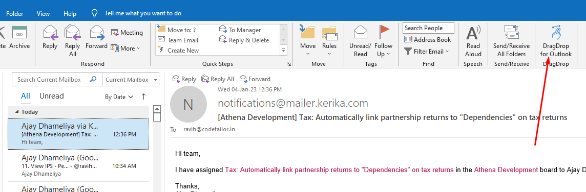
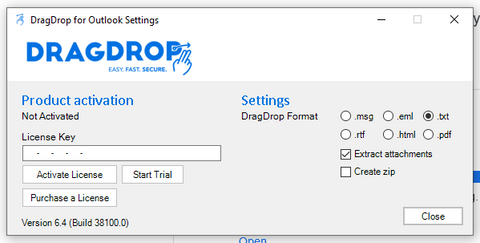
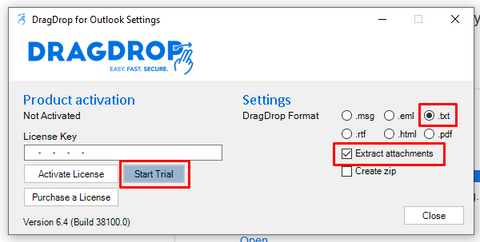

# Drag n Drop email from Outlook to Notes tab

The Clarius team is using Outlook on their Windows machine to manage email communication. They frequently need to copy the email content and paste it in notes. Currently they are doing it manually. To make this work of copy email to notes easy, we have implemented drag and drop emails into notes. 

## Technical notes
- Intead of re-inventing the wheels, we have used this application for drag n drop
- This app provides a way to drag email from Outlook and on drop provide some direct functions using which UI app can get the content of the email

## System rules
- Alows to drop the email from Outlook in to the Task notes tab
- On drag start event, highlights the notes block
- Allows to drop in case of single notes or multiple notes // TODO: put videos

## How to activate Trial of DragDrop for Outlook

### Installation
- Open this [link](https://www.dragdrop.com/download-free-trial/) to download the dragDrop application
- Enter the email
- Click on `Download DragDrop for Outlook` 
- It will download the `.exe` file
- Install the app

### Configuration
- Open outlook application in your machine
- Observe dragDrag menu at top right corner as below. 

- Click on the dragDrag menu shown in the above picture. On click it will open dialog as below

- Configure the below highlighted areas
    - Check the .txt 
    - Check the extract attachments in the dialog
    - Click on START TRIAL button
 
    

## How to user this features in Athena
- User can drag and drop the email from Outlook in to the Task notes tab. See [Single](https://drive.google.com/file/d/1Ae0GULXlENYFlyt5dxYYgU-5CDVa_vis/view?usp=share_link) notes and [Multi](https://drive.google.com/file/d/1XIw6HsIsL9IIA7wBEoLAEzml0Dfcv1CG/view?usp=share_link) notes.

## Feature enhancements
Currently drag and drop is only implemented in the task notes tab. We can implement it in other areas where you want. Let us know. 
