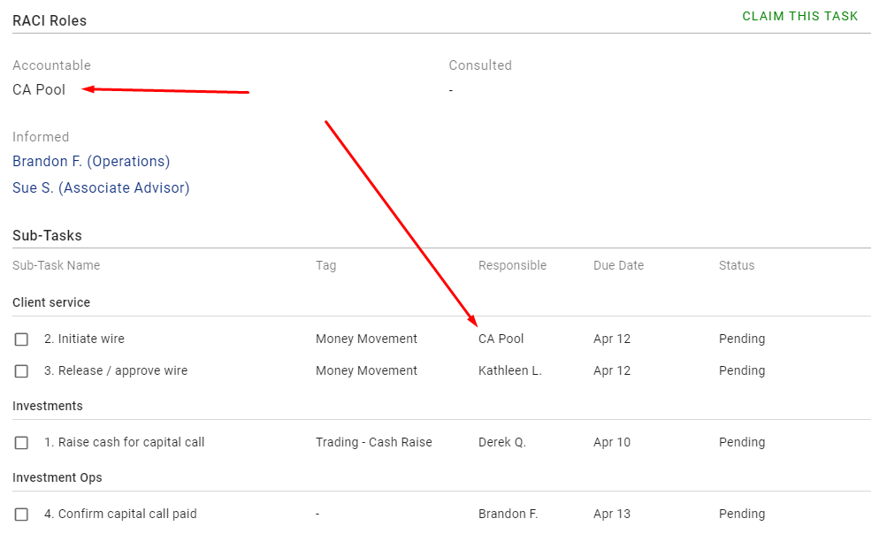

# Task Notifications

Purpose of the In App Notifications is, Associated users of the task get the alert notification. So they never miss any important updates about task where user is associated.

## System Rules

System shows notification in following cases where user is associated in any of the RACI roles in Open Tasks. (Whose notification date is arrived).

- When task is removed from his queue (This means assignment is changed such a way that user is now no longer associated with that task)
- When new task is added or assigned to his queue
- When start date is changed in such a way that task is moved to Upcoming
- When task is deleted 
- When task is marked as Done
- When task is Reopened (From Completed)
- When task is Restored (From Deleted)
- When any user claims CA Pool task 

User who has performed this action, won't get the notification. For e.g. If I am deleting any task, I will not get notification but other associated users will get notification.

User has to manually mark each notification as read. System allows users to mark any single message as read or all messages as read.

System auto marks `Reopen` or `New` or `Restore` notifications as read when user perform `Mark as read` action for that `Reopened` or `New` or `Restored` task from My tasks page.

Notification message always shows the current name of the task. For e.g. At the time of the notification is triggered, name of the task was `Task1` but currently name of the task is changed to `Task2`. In notification dialog, name of that task is shown as `Task2`

### Sub-Tasks Notification
- Currently for normal tasks we have implemented above notifications. All these notifications are still valid for Multi-Step tasks. We just need to assume that the responsible party at subtask level is also Responsible at the parent task. (Until task is completed)
- For Sub-Task, We will just implement one new notification - When Sub-Task is marked as done. This notification will be sent only to the Accountable party (and responsible party when other person marks subtask as done). I have explained this rule through one example.
- E.g. Consider a Multi-Step task `Prepare Madrona IX Subdocs for John and Jane`
    - Mike as an `Accountable` and Chelsea as a `Consulted`
    - Keith is `Responsible` for one Sub-Task

    - When Mike creates the above task: Chelsea and Keith get one notification for the parent task is added.

    - Later on, When Mike adds one new subtask in the above parent task where Braden is `Responsible`: Only Branden will get notification about the Parent task assigned to him. No notification for subtask.

    - When Mike deletes the parent task: Chelsea and Keith get one notification for the parent task is deleted. (Here I have assumed that Keith's subtask is Open and Branden's subtask is Completed)

    - When Branden completes the subtask and marks it as done: Only Mike gets notification about subtask is completed.

    - When Keith completes the subtask and marks it as done: Only Mike gets notification about subtask is completed.

    - When Mike marks the parent task as done: Chelsea gets one notification for the parent task is marked as done. (Here I have assumed that Keith and Branden’s subtasks are completed)

    - When Mike Reopens parent task: Chelsea gets one notification for the parent task is Reopened.

    - When Mike restored parent task from deleted tab to Open tab: Chelsea and Keith gets one notification for the parent task is Restored. (Here I have assumed that Keith's subtask is Open and Branden's subtask is Completed)
    
**Known Cases**
- System doesn't send a new notification of Sub-Task if a second sub-task is added to his queue.
  - Suppose `Sue` adds `Mike` as responsible for the Sub-Task. So `Mike` will see that task and Sub-Task in his queue. Now, `Sue` adds another Sub-Task to that task and sets `Mike` as responsible. So Mike will not get notification of the new subtask.

### CA Pool Tasks claims notification
- As per the [CA Pool](./ca-pool.md#overview) concept, tasks are assigned to a `CA Pool`. When other user claims a `CA Pool` task, senior person doesn't know that someone has claimed the `CA Pool` task. To solve this problem, we have introduced this this notification.  When user claims the `CA Pool` task, system will send notification to other user about this task has been claimed by this person. 
- This notifications will be sent to all users in the task's RACI role
- When multiple user claim the task, notification will show name of all the users

**Normal Task**

Suppose `CA Pool` is added as a Responsible and Consulted role in task. See below image

Now, Aimee claims this task. So the system will send a notification to Ravi, Ajay, Arun & Chirag. (Here, Aimee will not receive any notification)

**Multi-step task**

Suppose `CA Pool` is added as the Responsible role of the 1st subtask and the Accountable role of the Parent task. See below image

Now, Aimee claims this task. So the system will send notifications to the users Bradon, Sue, Kathleen, Derek. 

#### Partial or Full Claims
- System sends task notification in both `Partial Claims` & `Full Claims`. See blow examples to know what is `Partial claim` and what is `Full claim`

**Full Claims**
Suppose CA Pool is added as the Responsible & Accountable role. See below image

Now, `Ravi` claims this task. So `Ravi` will be added as an Accountable & Responsible role. System will send notifications to `Pratik`. So here, user claimed the all CA Pool roles. So this action is called as Full claims.
 

**Partial Claims**
Suppose CA Pool is added as the Responsible role of the both sub-tasks and the Informed role of the Parent task. See below image

Now, `Chetan`, `Chirag` & `Pavan` claimed the 2nd sub-tasks and `Ajay`, `Arun` & `Chelse` claimed the Parent task. Still `CA Pool` role is assigned to 1st sub-task. So this is called as Partial claims action.

## UX Rules

- Shows the Notification icon always in the App header and in the Home page.
- Shows Unread message count with icon. When there isn't any Unread message, count won't be shown but Icon will be visible always.
- On click of Notification icon in header, it shows Notification dialog. This dialog shows all unread notifications sorted by its arrival time. Latest notification will be at top. 
- Notifications are grouped by its type and shown in following order: 
  - Added to your Queue
  - Reopened
  - Restored
  - CA Pool Tasks Claimed 
  - Removed from your queue
  - Moved to Upcoming
  - Marked as Done
  - Deleted
- Shows count of task notification with each group.
- Shows the user's role along with the task notification when a new task is added or assigned.
  - Shows the multiple roles name if a user is added to more than one role in same task.
- Shows arrival date with each notification
- On mouse hover of any Notification, shows hover effect. 
- Always shows Mark as read icon for each notifictions
- On click of task notification, opens the Details tab of the view dialog of that task.
- At top of the Task notification dialog, shows `MARK ALL AS READ` button. On its click, all notification will be marked as read. 
- Notification dialog can be closed using X button and outside click
- If a user updates the task name and the notification of that task is already available then the name of the task will be updated in that notification.
- The maximum height of the notification dialog will be equal to the screen height. In case of overflow the scroller will come.
- Notification icon is also available when there isn't any unread notifications.
  - In such a case, On click, opens My Task page directly
  - In such a case, if user is already on My Task page, icon is disable. On hover it shows proper message in tooltip
- In Notification dialog, provides a way to quick navigation to My Task page at bottom of the dialog. If user is already on My Task page, button is disable. On hover it shows proper message in tooltip.

## UI Rules

[See this Mockups](https://drive.google.com/file/d/1aJ4mCoh4u976oqoe3prxKAzSv-Q03fDF/view)
- Tooltip message when notification icon is disable or `GO TO MY TASK` button is disable: `You are already on My Chat page`

### Notification message text

- When task is removed from queue
  - `Task title | Entity name} | Due on:{Due date}` has been removed from your queue
- When start date is changed in such a way that task is moved to Upcoming
  - `Task title | Entity name} | Due on:{Due date}` has been moved to Upcoming
- When task is deleted
  - `Task title | Entity name | Due on:{Due date}` has been deleted by `User` (Name of the user who has deleted the task)
- When task is marked as Done
  - `Task title | Entity name | Due on:{Due date}` has been marked as Done by `User` (Name of the user who has marked that task as Done)
- When task is Reopened from Completed
  - `Task title | Entity name | Due on:{Due date}` has been Reopened by `User` (Name of the user who has Reopened the task)
- When task is Restored from Deleted
  - `Task title | Entity name | Due on:{Due date}` has been Restored by `User` (Name of the user who has Reopened the task)
- When new task is added or assigned
  - New task `Task title | Entity name | Due on:{Due date}` has been added to your queue as {`Role name of the user`}.
- When Sub-Task is marked as Done
  - "`{Sub-Task name}`" assign to `{Responsible person}` is marked as done by `User`. (Name of the user who has marked that Sub-Task as Done)
- When CA Pool task is claimed
  - Normal task: `{Name of the users who claimed}` claimed this `Task title | Entity name | Due on:{Due date}` as {`Role name of the user`}
  - Multi-step task: {Multi-step icon} `{Name of the users who claimed}` claimed this `Task title | Entity name | Due on:{Due date}` as {`Role name of the user`}

## Known Case

##### A task has both new and reopen notifications. Now if the user `Mark as Read` the reopen notification, both notifications (New and Reopen) will be `Mark as Read` simultaneously.

**Scenario**

Given: I have added one one-time task of `Task1`  where I'm added as a Responsible role and `Ajay` is added as Informed role. (Here consider that `Task 1` is an open task)
And: `Ajay` can see the `New` tag for the `Task 1`.
When: If I mark that task as done 
Then: the card will appear in the done bucket for both. 
And: System sends a notification to `Ajay`.
When: I reopen that task. 
Then: system sends another notification to `Ajay`.
And: when Ajay sees the task, he shows the `Reopen` tag.
When: If Ajay `Mark as Read` the `Reopen` notification
Then: The system will also `Mark as Read` the `New` notification of that task.

**Technical point**

- When the reopen notification is `Marked as Read` the, UI app calls 2 API to mark `New` and `Reopen` notification as read.

##### Always shows current role with the task notification

**Scenario**

Given: `Sue` has one unread task notification for any task is added to her queue as Accountable
When: `Mike` removes Sue from a Accountable role.
Then: `Sue` gets another notification for a task is removed from her queue
When: `Sue` opens the task notification dialog
Then: `Sue` can see both notifications in the task notification dialog
And: Role doesn't appear in the first notification for `Sue`

## Mark as Read / Mark all as Read

- Applicable only for `New` and `Reopen` tasks.
- Single notification or multiple notifications can also be marked as read.
  - In case of multiple notifications: Shows `Mark ALL AS READ` action in notification dialog. On click, considered all notifications will be marked as read and removed from the dialog.
  - In case of single notification: On hover of notification, shows the icon. On click, a particular notification will be marked as read and removed from the dialog. Notification won't be clickable.
- There are three way to marked the task as read
  1. Even if user opens a view dialog of `New` and `Reopen` task, their notification will be marked as read.
  1. In vertmore action of the `New ` and `Reopen` task
  3. In notification dialog
     1. By `Mark as Read` icon action 
     2. By `Mark all as Read` action button
