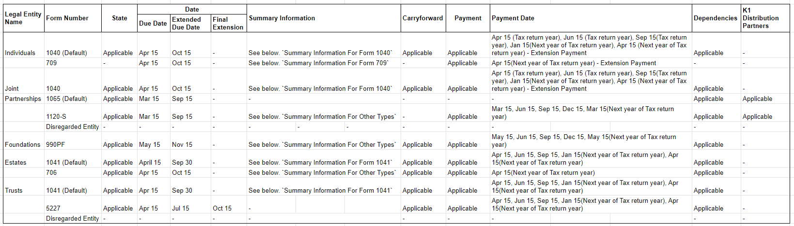

# Tax Return

## Overview

- Each type of Legal entity has some predefined form for Tax return
- There can be only one Tax return of same form in a given year for any legal entity.

## Entity

### Basic details

|             | Field Name            | Description                              |                                          |
| ----------- | --------------------- | ---------------------------------------- | ---------------------------------------- |
| Summary     |                       |                                          |                                          |
|             | Tax Year              | Number input. Allows only four digits    |                                          |
|             | Tax Filing Status     | Its a disable field It shows the current status of Trust either Grantor or Non-Grantor. | Applicable only for Grantor or Non-Grantor Trust |
|             | Grantor Filing Status | Its dropdown field.  Dropdown values are : "Filed on Grantor's Tax Return" or "Filed under 1041 Trust Return". Default is set to `Filed on Grantor's Tax Return` | Applicable only for Grantor type Trust.  |
|             | Form                  | Shows form                               | Not applicable for Grantor type trust and Grantor filing status is `Filed on Grantor's Tax Return`. |
| Preparation |                       |                                          |                                          |
|             | Preparer              | Contact Autocomplete                     | Not applicable for Grantor type trust and Grantor filing status is `Filed on Grantor's Tax Return`. |
|             | Preparer (Firm)       | Company Autocomplete                     | Not applicable for Grantor type trust and Grantor filing status is `Filed on Grantor's Tax Return`. |
| Payment     |                       |                                          |                                          |
|             | EFTPS                 | Bank autocomplete of type Checking Only shows Active bank account (Not Closed ) | Applicable only when payment is applicable to selected form |
|             | Who Issues Payments   | One of the following options. Default option is `Client` - `Clarius on Behalf of the Client` - `Client` - `Third Party` | Applicable only when payment is applicable to selected form |
|             | EFTPS Pin (*)         | Number input. Only 4 digits allowed      | Applicable only when EFTPS is enabled    |
|             | Enrolment Number(*)   | Number input. Only 18 digits allowed     | Applicable only when EFTPS is enabled    |

## Legal entity and Form wise Tax Return details

[File of above image](https://docs.google.com/spreadsheets/d/1FjAcGjfDNoSwr_U5uOIrAcb6aAZQSbqSf0W38zeWvD4/edit#gid=0)

### Payment Entity

| Field Name       | Description                              |                                          |
| ---------------- | ---------------------------------------- | ---------------------------------------- |
| Name             | Date of the payment                      |                                          |
| Status           | Possible values: Pending (Default), Information Sent, Paid, No Payment Due |                                          |
| Information Sent | Date input                               | Applicable  when status is other than Pending. Date less than current year is not allowed |
| Payment Method   | Possible values: Check, EFTPS, Not Known, Direct Pay. Default is `Check` | Applicable  when status is Paid          |
| Amount           | Currency input                           | Applicable  when status is Paid          |
| Payment Made     | Date input                               | Applicable  when status is Paid. Date less than current year is not allowed |
| Notes            | Free form multiline text field           |                                          |

### General

#### Date

| Field Name            | Description                              |
| --------------------- | ---------------------------------------- |
| Due date              | See [Form wise due date](#form-wise-due-dates) |
| Extended due date     | See [Form wise due date](#form-wise-due-dates) |
| Expected filling date | Date input. Date less than current year is not allowed |
| Date filed            | Date input. Date less than current year is not allowed |

#### Summary Information for Form 1040

| Field Name              | Description                              |
| ----------------------- | ---------------------------------------- |
| Total Income            | Currency input. Decimal not allowed. Negative amount is allowed. Mandatory field to set status `Filed` |
| Adjusted Gross Income   | Currency input. Decimal not allowed. Negative amount is allowed. Mandatory field to set status `Filed` |
| Taxable Income          | Currency input. Decimal not allowed. Negative amount is allowed. Mandatory field to set status `Filed` |
| Tax or Total tax        | Currency input. Decimal not allowed. For form 1041 will be displayed as `Total Tax`. For form 1040 it will be displayed as `Tax`. Mandatory field to set status `Filed` |
| Alternative Minimum Tax | Currency input. Decimal not allowed. Only applicable to form 1040. Mandatory field to set status `Filed` |
| Total Credits           | Currency input. Decimal not allowed. Only applicable to form 1040. Mandatory field to set status `Filed` |
| Other Taxes             | Currency input. Decimal not allowed. Only applicable to form 1040. Mandatory field to set status `Filed` |
| Total Tax Due           | Calculated field.  `Tax` + `Alternative Minimum Tax` - `Total Credits` + `Other Taxes` |
| Effective Tax Rate      | Input is not allowed. its Calculated field. Negative amount is allowed. Calculation formula : `Effective Tax Rate = (Total Tax Due / Total Income) * 100` |
| Marginal Tax Rate       | Percentage input. Two decimal points allowed. |

#### Summary Information for Form 1041

| Field Name            | Description                              |
| --------------------- | ---------------------------------------- |
| Total Income          | Currency input. Decimal not allowed. Negative amount is allowed. Mandatory field to set status `Filed` |
| Adjusted Gross Income | Currency input. Decimal not allowed. Negative amount is allowed. Mandatory field to set status `Filed` |
| Taxable Income        | Currency input. Decimal not allowed. Negative amount is allowed. Mandatory field to set status `Filed` |
| Total Tax             | Currency input. Decimal not allowed. Mandatory field to set status `Filed`. |

#### Summary Information for Form 709

| Field Name                        | Description                                                  |
| --------------------------------- | ------------------------------------------------------------ |
| Remaining Exemption into (year)   | Input is not allowed. Auto calculated field. this field is pulled from master ledger. |
| Total Gift                        | For `Lifetime Exemption`, //TODO For `GST Exemption`, //TODO  Amount of `Total Gift` is pulled from the `Total Given` amount from the Gifting app for that individual for that year. Default value set to `$ 0`. |
| Annual Exclusion                  | Currency input. Decimal is allowed. Default value set to `$ 0.00`. If the value of  `Annual Exclusion` is greater than `Total Gift`, it will show error. Error text is : `Should be <= Total Gift`. |
| Net Gift                          | Input is not allowed. Auto calculated field. Decimal is allowed.  Calculation formula : `Net Gift = Total Gift - Annual Exclusion`. |
| Remaining Exemption out of (year) | Input is not allowed. Auto calculated field. Default value set to `$ 0`. Calculation formula : `Remaining Exemption out of (year)`= `Beginning Lifetime Exemption(Year)` - `Lifetime Exemption Used`. If the value of `Remaining Lifetime Exemption` is less than 0, show only 0. (Do not show value with `-` sign) |
| Tax Due                           | Currency input. Decimal and Negative amount is not allowed. Mandatory field to set status `Filed`. |

#### Summary Information for Other Form (1120-S, 990PF, 706)

| Field Name   | Description                              |
| ------------ | ---------------------------------------- |
| Total Income | Currency input. Decimal not allowed. Negative amount is allowed. Mandatory field to set status `Filed` |
| Tax Due      | Currency input. Decimal not allowed. Mandatory field to set status `Filed`. |

#### Carryforward

| Field Name                               | Description                         |
| ---------------------------------------- | ----------------------------------- |
| Short-term Regular Capital Loss Carryforward | Currency input. Decimal not allowed |
| Long-term Regular Capital Loss Carryforward | Currency input. Decimal not allowed |
| Passive Activity Loss Carryforward       | Currency input. Decimal not allowed |
| Charitable Carryforward                  | Currency input. Decimal not allowed |
| Ordinary Loss Carryforward               | Currency input. Decimal not allowed |

#### Dates

| Field Name           | Description                              |
| -------------------- | ---------------------------------------- |
| Due Date             | Value will be set based on the selected form. Doesn't allow to change this date |
| Extended Due Date    | Value will be set based on the selected form. Doesn't allow to change this date |
| Final Extension      | Value will be set based on the selected form. Doesn't allow to change this date. Only applicable to form `5227` |
| Expected Filing Date | Date input. Date less than current year is not allowed |
| Status               | Pending, Extended, Filed. Default value is `Pending` Status can be set `Filed` only when  - All components are in status other than `Pending`  This status has nothing to do with Payment status. Even if payment status is pending  , status can be set to `Filed` |
| Date Filed (*)       | Applicable only when `Status` = `Filed`.  Do not allow to enter date lower than current year (for e.g. for 2019 return do not allow enter any date less than 01-01-2019) |

#### Dependencies

- Allows to select multiple `Legal entity`. For each entity allows to select applicable `Form`
- When `Dependency` status is N/A, it should not be link.
- When the `Dependency` status is not N/A, it should be link. On click of `Dependency` link it should open the tax return of the same year for that legal entity.

#### K1 Distribution Partners

- Applicable to only Partnership forms: `1065` & `1120-S` 
- Allows to select multiple contact, partnerships and Trusts. For each partners allows to add `Date` and `Notes`

| Field name | Description                              |
| ---------- | ---------------------------------------- |
| Partner    | Contact, Partnerships and Trusts autocomplete |
| Date       | Date input. Future date is not allowed   |
| Notes      | Multi line text field                    |

#### Notes

- Free form text field

## System requirement

### Create Tax return

- Allows to create Tax return by filling `Basic details`
- Doesn't allow to create Duplicate tax return with same year and same form
- System prefills data from available latest tax return. If last records not available then fields will be blank
- If payment is applicable for selected form, then only ask for payment related fields : EFTPS, Who Issues Payments, EFTPS Pin, Enrolment Number
- In 5227, Payment field is applicable in create new Tax Return even payment is not applicable for this form (This is special case)

#### Disregarded Entity

- For Grantor trust and Partnership sometimes it doesn't have own tax return. But it tax return is filed under Grantor or Owner. 
- For Grantor trust, there are two possibilities. Separate tax return for Trust is filed or Tax return is filed under Grantor's tax return. So at the time of creating tax return for any year, system allows user to choose any one option and based on that tax return is created.
  - When user selects `Filed on Grantor’s Tax Return`, it will not ask any information. 
  - When the user selects `Filed under 1041 Trust Return`, it will only show fields related to  `Preparation` section. Payment fields are not shown as payment is not applicable for this.
- For Partnership whose Tax ID type is SSN, separate Tax return can not be filed. Instead it is always filed under any of its owner. So it will not ask any information. 

### UI Requirement

Mockup //TODO

#### Payments

- Based on the selected form, `Payments` section will be populated.  For different forms payment dates  are different. One payment for each date  and one `Final payment` will be created. See [Payment Entity](#payment-entity) for more detail.
- For `1040`,`1041`,`990PF`,`706`,`1120-S` two extra fields will be there under Payments section: `Applied from prior year` and `Federal Income Tax Withheld`
  - For `1041`, If trust is Grantor then payment section won't be applicable.
- `Applied from prior year` is pulled from `Applied to next year` amount of last year tax return. If last year tax return is not available allows user to input amount in this field.
- Allows user to enter amount in `Federal Income Tax Withheld`. Decimal is not allowed. Default value is set to `$ 0`.
- For some of the forms `Payment` is not applicable. For such forms, `Payments` section won't be populated at all. 
- `Total Payments` = `Applied from prior year` + `Federal Income Tax Withheld` + Amount of all date wise payments + Final payments
- Form `1040`, user can enter a `Penalties and Interest` for that tax return. Decimal is not allowed. Default value is set to `$ 0`.
- Difference between `Total Payments` and `Tax Due` can be either Refunded or can be applied to next year. If `Amount refund`  is not entered all difference amount will be applied to next year. If `Amount Refund` is entered it will be subtracted from difference amount first and rest of the difference amount will be set to `Applied to Next Year`

#### General details

- Based on the selected form,  `General` section will be populated. For different forms, details in `General` section will be different
- Carryforward
  - Carryforward section has two type of data. `Into year` and `Out of year`
  - Value in `Into Year` will be retrieved from `Out of Year` values of last year Tax return for this legal entity. If last year return is not available then only allows to input value here.
- Dependencies
  - If `Dependencies` available in last year tax return, it will also be prefilled. 
  - When Dependency status is N/A, it should not be link.
  - Shows status of tax return of same year of that dependency. If Tax return is not available shows `N/A`

### Edit `Basic details` of Tax return

- Year and form can't be changed
- For `Grantor Trust`, `Grantor Filing Status` also can't be changed.
- Other details can be changed anytime

### Add State

- Shows list of states of USA. 
- Allows to add as many states as required. One state can be added only once.
- For each states, `Payments` and `General` section will be populated. 
  - If `Payments` section is not applicable for federal then it also doesn't applicable in state and if its applicable for federal  then its same as `Federal`. 
- `Applied from prior year` is pulled from `Applied to next year` amount of last year tax return for the same state. If last year tax return is not available for this state, allows user to input amount in this field.
- in General section only `Dates` ,  `Carryforward`, [`Summary Information`](#summary-information-for-state) and `Notes` are only populated.  Other details are not applicable for `State`
- `Dependencies` and `K1 Distribution` is not applicable in the State Tax Return.
- For form `709`, state is not applicable. So doesn't allow to add states
- In Carryforward section, Value in `Into Year` will be retrieved from `Out of Year` values of last year Tax return of this state. If last year return is not available for this state,  then only allows to input value here.

#### Summary Information for State

| Field Name           | Description                              |
| -------------------- | ---------------------------------------- |
| State Taxable Income | Currency input. Decimal not allowed. Negative amount is allowed. Mandatory field to set status `Filed` |
| Tax Due              | Currency input. Decimal not allowed. Mandatory field to set status `Filed`. |

### Delete state

- Allows to delete state anytime.
- On click opens delete confirmation dialog. See this //TODO

### Audit

- Audited is only applicable for 1040 form
- When Audited is true, 
  - System ask for name of the `Audit`
  - Allows to enter new values of [Summary information](#summary-information) and [Carryforward](#carryforward)
- When `Audited` is true, system shows Original and  audited both values in `Summary information` and  `Carryforward` 

### Disable Payment

- Payments can be disabled if required. When its disabled all payments of `Federal` and `States` will be deleted.
- When payment is disable, `Audited`, `Summary Information` and `Carryforward` will be reset and won't be shown in General section.

### Enable Payment

- System allows to Enable Payments if its already disabled. On Enable, system creates applicable payments in `Federal` and `States`

### Download PDF

- Allows to download Summary or Tax return.
- On Download action, Downloads PDF in same browser tab
- Tax return PDF file name will be in format: `tax-return-report-{Legal entity name}-{Tax return year}({Tax return form}).pdf`
- Tax summary PDF file name will be in format: `tax-summary-report-{Legal entity name}-{Tax return form}.pdf`

#### UI Requirements

- Mockup of Tax Return PDF //TODO
- Mockup of Tax Summary PDF //TODO

### Archive

- Allows to Archive anytime
- Doesn't allow to edit when Archived

### Delete

- Allows to Delete anytime
- On click opens delete confirmation dialog. See this

### Browse Tax Return

- Column name
  - Year
    - It show tax return year
  - Form
    - Shows form number
    - For Disregarded entity tax return Form is not applicable so it will show message `Disregarded Entity`.
  - Status
    - Status of tax return. It should be `Pending`, `Received`, `Paid`.
    - Showing 'Filed' status in green and 'Extend' status in orange colour.
  - Total
    - Show total count of All Components.
    - For Disregarded entity this is not applicable
  - Pending
    - Show total count of pending components
    - Shows count of Pending and Overdue component are separated by pipe.
    - The calculation of the overdue component will be shown in red. A tooltip message `{Count number} items are overdue` will appear on its hover.
  - Received
    - Show total count of received components
  - Sent
    - Show total count of Sent components.
  - States
    - If states is not applicable, then shows `-`.
    - If a tax return has more than one state available, that state will show up in different rows.
      - It will show a status with each state in bracket.
      - For Disregarded entity this is not applicable
  - Preparer
    - Show preparer name of that tax return.
    - For Disregarded entity this is not applicable
- Records are sorted in descending order of Year.
- If records is not available in any column then show -.
- When no records available then show `No Tax Returns Found`.
- On hover, show vertmore action. Vertmore action are : `Archive` & `Delete`.
- On clicks, opens view page of that tax return.

## UI requirement

[Mockups](https://drive.google.com/drive/u/0/folders/1jRHPtA8_5nes3ekvm5R87P1e4SXwi1Cg)

### Summary tab 

- Only applicable to form 1040 and 1041 because `Summary information` are only applicable in these forms.  For other form this tab won't be shown
- Shows the overview detail of last five years tax returns regardless of its status. For ex. If current year is `2021` then summary tab will show last five year like `2020, 2019, 2018, 2017, 2016`.
- Summary data is also reset on the payment disable.
- Summary section have one pdf icon, on clicks download

#### UI Requirement

Mockup of Summary tab //TODO

### State dropdown

- On click of `Add State`, opens dropdown with states of USA
- In dropdown, Shows records in ascending order
- In dropdown, States which are already added will be shown as disabled. So that user can not click on it.

- Multiple delete of tax return is not possible (Old app doesn't have such feature, so we deliberately not implemented it)

#### For Joint

[Mockups](https://gallery.io/projects/MCHbtQVoQ2HCZfBS-vT-eRyP/files/MCEJu8Y2hyDScXY-SXhmlYyxsGbucFXg8S8)

For Joint entity, shows tax returns of both Joint and Individuals. 

In list page for ACTIVE and ARCHIVED, with each record shows the name of the owner entity. 

Records are primarily sorted on Year and secondary on entity type. In same year Joint record will be shown first and individual records are shown after joint. 

If owner of the record is Joint it shows `Joint` and if owner of the record is `Individual` shows First name of that Individual.

Summary tab shows separate table for Joint and each individuals. If no record available for any entity, that table won't be shown
