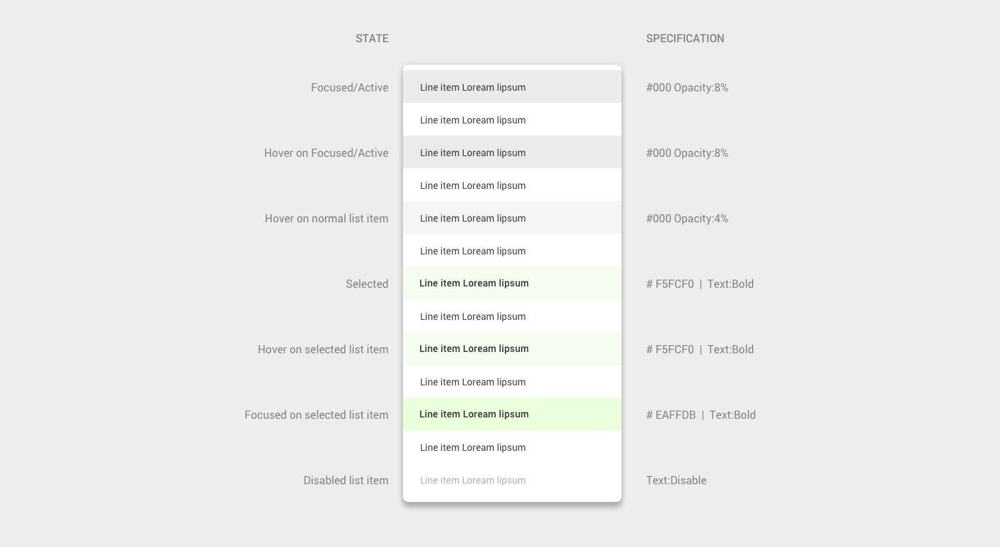

# List item

- All sepecifications are as per standard [material design guidelines](https://material.io/components/lists/#)
- It can be Single line, Two line or Three line.

## States

List item can be in one of the following state

- Normal
- Focused/Active
- Hover
- Selected
  - Text are bold
  - Somtimes selected item can have `checkbox` icon at right side
  - Sometimes to show inner data, it can have `> icon` at right side
- Disabled
  - Text are in disable style
  - Focus or Hover not possible

## Red line specification